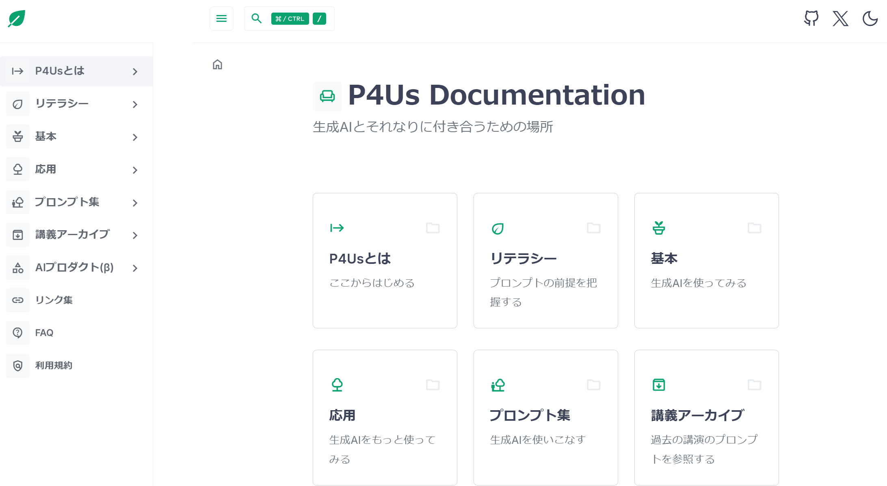
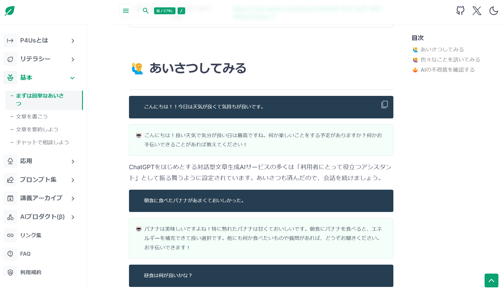

# Prompt Guide for University staff - P4Us🌱

**Prompt Guide for University staff(P4Us)は大学職員が生成AI利用の文化を理解し、プロンプトを学ぶためのプロンプトガイドです。**  
「固すぎず柔らかすぎない」「難しすぎず易しすぎない」情報整備を心がけます。

> 🚀 はじめる：[https://promptforus.com/](https://promptforus.com/)

> 🚀 ホーム画面へ：[P4Us Documentation](https://promptforus.com/docs)

## 🔰 P4Usの使い方
### 💻 プロンプトを生成AIに入力する

**プロンプト**はコンピュータ画面に対して指示を出すこと、促すことを指す言葉です。  
転じて生成AI利用の文脈では、**生成AIに対する指示文・命令文の総称**として使用されています。  
(P4Usが取り扱う生成AIの意味は本ページ後半で説明します)

P4Usでは各ページにプロンプトが掲載されており、その全てが簡単にコピーできるようになっています。  
コピーしたプロンプトは実際にChatGPTやCopilot等の生成AIに入力できるものです。  
参考として生成AIから得られた回答(生成物)も記載していますが、必ずこの回答が返ってくるとは限りません。

- **利用者自身が実際に入力してみることを強く推奨します**
- **生成AIを利用するためのアカウント登録等の手続きは取り扱っておりません**
  

### 📚 プロンプトを参照する
**それなり**に、様々なプロンプトを用意しています。
- 各所から収集したプロンプト
- 運営者が日々使っているプロンプト
- 運営者が生成AIに関する講演の中で使用したプロンプト
- 運営者がワークショップ参加者より収集したプロンプト

現時点で何百ものプロンプトがあるわけではありません。  
掲載するプロンプトの数は増やし続ける方針ですが、  

- **まずは一つ一つのプロンプトの意味や目的が分かるように、できる限りていねいな説明を重視しています**
- **上級者向けのプロンプトや複雑すぎるプロンプトは掲載していません**

### 👍 生成AIとの付き合い方を知る
生成AIは2023年時点の流行語である一方、インターネットと同様に発展・普及が見込まれているAI技術です。  
今後は生成AIとの正しい付き合い方、ちょうどいい付き合い方を知ることがとても大切だと考えられます。

### ⚖️ できること・できないこと

❌ AI技術の基本を体系的に理解する  
⭕ **アプリ・サービスとして公開されているサービスを使ってみる**  

❌ AI研究の知見や最新動向を理解する  
⭕ **生成AI利用の最低限の姿勢・リテラシーを身に付ける**  

❌ プロンプトエンジニアリングの最新動向を理解する  
⭕ **それなりに良いプロンプトの在り方を理解する**  

> 🚀 はじめる：[https://promptforus.com/](https://promptforus.com/)

### P4Usでは大規模言語モデル(LLM)を使用したテキスト生成AIサービスをまとめて「生成AI」と呼びます。  
この「生成AI」の一例です。

* [ChatGPT](https://chat.openai.com/ "ChatGPT") 
  * OpenAIが開発・提供する生成AI
* [Copilot](https://copilot.microsoft.com/ "Copilot")
  * Microsoftが開発・提供する生成AI / OpenAIが開発したAIを利用
* [Bard](https://bard.google.com/chat "Bard")
  * Googleが開発・提供する生成AI
* [Claude](https://claude.ai/ "Claude")
  * Anthropicが開発・提供する生成AI

星の数ほどあり、日々技術・インターフェースが変化し続けているので、全てを比較・説明することはできません。  
好きなものを使ってください。おすすめはChatGPTとCopilotです。  

##### ChatGPT
生成AIブームの立役者であり主人公、対話型生成AIサービスです。**「いいから登録しとけ」の筆頭。** 複数のLLMベンチマークではほぼ負けなしのGPT-4をはじめ、無料でも汎用的かつ高速なGPT-3.5を使用できます。画面のシンプルさゆえに何を入力していいから分からない人が続出していいます。

##### Copilot
生成AI搭載の検索エンジンです。GPT-4モデルを使用した検索エンジンを無料で使用できる点、検索エンジン故に回答に出典が明記される点、Edgeブラウザ(今後はWindowsOS?)との連携が極めて便利な点が強みです。

## 👾 P4Usの運営者
gmorikiが個人で運営しています。元大学職員で、今は大学職員風味の何かです。AIの研究者ではありません。文章下手です。
- [researchmap](https://researchmap.jp/gmoriki)

メールアドレスも公開しておりますので、相談・講演依頼、なんでもお気軽にご連絡ください！  

P4Usを作った理由やねらいは、2023年11月30日の記事をご参照ください。  
- [大学職員のためのプロンプトガイド「P4Us」を作ってしまった理由](https://note.com/pogohopper8/n/n34d3e4de7b5e)

## License
[MIT LICENSE](https://github.com/gmoriki/Prompt4Us/blob/main/LICENCE)