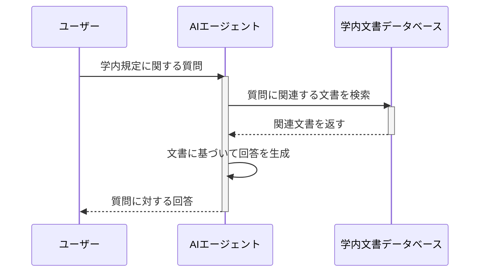
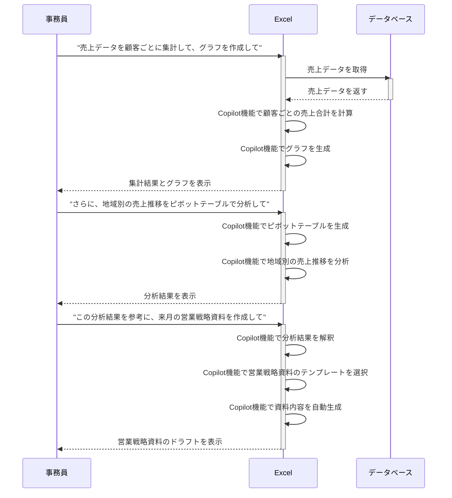


| 日時 | このページで使用した生成AI |
|----------|--------------|
| 2024/09/24 | Copilot,ChatGPT |


#### 使用する主な生成AI：

| 名称                                              | 説明                                                      |
|---------------------------------------------------|-----------------------------------------------------------|
| [ChatGPT](https://chat.openai.com/)               | OpenAI社が開発・提供する対話型生成AIサービス              |
| [Copilot](https://copilot.microsoft.com/)         | Microsoft社が開発・提供する対話型生成AIサービス          |



#### その他生成AI：

| 名称                                              | 説明                                                      |
|---------------------------------------------------|-----------------------------------------------------------|
| [Gemini](https://gemini.google.com/chat)              | Google社が開発・提供する対話型生成AIサービス              |
| [Claude](https://claude.ai/)                      | Anthropic社が開発・提供する対話型生成AIサービス           |
| [Perplexity](https://www.perplexity.ai/)          | Perplexity AI社が開発・提供する対話型生成AIサービス      |



## はじめに

```markdown
日本の首都は？
```

```markdown
この対話に関するレポートを作成してください
```

## 業務に役立つプロンプトを使ってみる

### 文章の作成

#### 告知・通知文書を作成する

```markdown
API変更に伴ってシステムの一部機能を廃止する告知文を作成してください
```

```markdown
あなたはWebシステム運用のスペシャリストです。
以下の文脈と要件に従って、利用者向けの告知文を作成してください。

### 文脈 ###
運用している[WebシステムA]の「XXX」項目内にある機能「YYY」を廃止する。
理由は、学術論文データベースである[DB-W]が今まで使用していたSOAP APIが20XX年12月31日で終了し、RESTAPIに移行するため。
よって12月24日を以って「YYY」は使用不可となる。

### 条件 ###
* 「[WebシステムA]をいつもご利用いただきありがとうございます。」から始める
* 最初から最後まで丁寧な言い回しを心がける
* 告知文は日本語で400文字程度とする
```

追加の指示案：

```markdown
作成した告知文を自然な英語と中国語に翻訳してください
```

#### 企画書の作成(IR活動)

```markdown
大学IR活動の企画書を作成してください。教員の研究時間を阻害する要因を特定したいです。
```

```markdown
あなたはInstitutional research(以下、IR)の責任者です。
※ Institutional research is research conducted within an institution of higher education to provide information which supports institutional planning, policy formation and decision making.

以下の要件に従い、まずIR活動の企画書の枠組みを設計してください。
その後、枠組みの概要を出力してください。

### 要件 ###
* 教員の研究時間を阻害する要因を特定したい。
* 分析した結果を研究力不足の改善に役立てたい。

### 出力 ###
企画書：1000文字程度
概要：200文字程度
```

### 文章の要約・検索

#### 文章を要約する

参考：[文章自動要約の例文](https://www.hitachi-solutions-east.co.jp/products/coreexplorer_ts/example/)

```markdown
以下の文章を要約してください。

Excel でプロジェクトの日程管理をしている企業は多い
Excel はオフィス業務に欠かせないアプリケーションであり、多くの人が慣れ親しんでいるスタンダードツールだ
しかし、複数プロジェクトが関連しあって同時進行していると、変更の際の整合性が課題となる
大手情報関連機器メーカーでは、大日程管理の対象機器が年間数百種に及び、さらにその中日程、小日程があり、膨大な数になっていた
これらが同時に進み、その調整や変更への対応が従来の管理方法では限界を超えていた
グループ全体でのプロジェクト管理の標準化や効率化、さらには同社の推進するIT 戦略の一環として、対策を検討
そこで、採用されたのが日立ソリューションズ東日本の提供する工程管理・プロジェクト管理ツール『SynViz S2』であった
採用の決め手となったのがシャドウ機能だ
関連する日程表を別の日程表に貼り付けると、元の日程表の変更がリアルタイムに反映される
例えば、中日程に貼り付けられた大日程の予定が変更されても、見逃すことがなくなる
同社ではアドオンで大日程・中日程・小日程間を連携する機能も追加した
Excel の使いやすさと見やすさそのままに、SynViz S2 に備わった機能の利便性が高く評価され、全社での展開が進められている
さらに海外生産拠点での導入も視野に入ってきた
```

```markdown
# 命令書:
あなたは{プロの編集者}です。
以下の制約条件と入力文をもとに{最高の要約}を出力してください。

# 制約条件:
- 簡潔に本質が理解できるようなストーリー(背景、課題、ソリューション)を採用する
- 重要なキーワード「効率化」を強調する
- 最後に####備考 を設け、表計算ソフト・Excelについて一言で解説する
- 回答は300文字

# 入力文：
Excel でプロジェクトの日程管理をしている企業は多い
Excel はオフィス業務に欠かせないアプリケーションであり、多くの人が慣れ親しんでいるスタンダードツールだ
しかし、複数プロジェクトが関連しあって同時進行していると、変更の際の整合性が課題となる
大手情報関連機器メーカーでは、大日程管理の対象機器が年間数百種に及び、さらにその中日程、小日程があり、膨大な数になっていた
これらが同時に進み、その調整や変更への対応が従来の管理方法では限界を超えていた
グループ全体でのプロジェクト管理の標準化や効率化、さらには同社の推進するIT 戦略の一環として、対策を検討
そこで、採用されたのが日立ソリューションズ東日本の提供する工程管理・プロジェクト管理ツール『SynViz S2』であった
採用の決め手となったのがシャドウ機能だ
関連する日程表を別の日程表に貼り付けると、元の日程表の変更がリアルタイムに反映される
例えば、中日程に貼り付けられた大日程の予定が変更されても、見逃すことがなくなる
同社ではアドオンで大日程・中日程・小日程間を連携する機能も追加した
Excel の使いやすさと見やすさそのままに、SynViz S2 に備わった機能の利便性が高く評価され、全社での展開が進められている
さらに海外生産拠点での導入も視野に入ってきた

# 出力文：
3点(背景、課題、ソリューション)に箇条書き
#### 備考
...
```

#### 紹介文の作成

```markdown
あなたは大学広報担当の専門家です。以下の文脈と要件に従って、大学の魅力を伝える紹介文を作成してください。

### 文脈 ###
1. **多彩な学問分野**: 理工学、建築、都市環境、情報、AI、都市生活、人間科学、幼児教育、データサイエンスなど、幅広い分野をカバーする8つの学部と18の学科があります⁴。
2. **充実した施設と設備**: 学食、体育館、図書館など、設備が充実しています。特に図書館は豊富な本を提供しており、勉強に役立ちます⁵。
3. **キャンパスの魅力**: 東京都心に近い世田谷と神奈川の横浜に位置し、美しい環境で学べるキャンパスです。学生同士や教職員との距離が近く、アットホームな雰囲気があります⁴。
4. **キャリア支援**: 就職支援イベントや卒業生の協力を通じて、学生のキャリア形成をサポートしています⁴。

東京都市大学は、社会課題に挑戦し、実践力を養う場所として、多くの学生に選ばれています。
### 条件 ###
* 「[大学名]にご関心をお寄せいただき、誠にありがとうございます。」から始める
* 最初から最後まで丁寧な言い回しを心がける
* 紹介文は日本語で400文字程度とする
```


### 分からないことの説明や言い換え、相談

#### 説明や言い換え

```markdown
率先垂範の意味と類義語を大学事務職員に対して分かりやすく説明してください
```

```markdown
次のメッセージを正しい敬語に言い直してください。
 
絶対いま忙しいと思うから返信は不要ですマジで
```

#### 相談

```markdown
無条件に褒めてくれ〜〜でも無理に頑張れと言って私を鼓舞させるのではなく、ありのままの私を認めてほしい。あなたの回答の一言一句が私の労働生産性に直結します。
```

```markdown
DNS切り替えが数日で終わらない可能性がある旨を、事務職員にでもわかるように説得して
```

#### プロンプトをつくるプロンプト

````markdown
あなたは対話型生成AIへの指示を最適化するエンジンです。
以下の要件・期待に適したプロンプトテンプレートを{{contents}}に提供してください。

# 優れたプロンプトテンプレートの例
**利用者からの指示、指示の要件・条件、利用者の入力、出力形式が明快な、**
以下のテンプレートの構造を参照しなさい。
template = ```markdwon
あなたはWebシステム運用のスペシャリストです。
以下の文脈と要件に従って、利用者向けの告知文を作成してください。

### 文脈 ###
運用している[WebシステムA]の「XXX」項目内にある機能「YYY」を廃止する。
理由は、学術論文データベースである[DB-W]が今まで使用していたSOAP APIが20XX年12月31日で終了し、RESTAPIに移行するため。
よって12月24日を以って「YYY」は使用不可となる。

### 条件 ###
* 「[WebシステムA]をいつもご利用いただきありがとうございます。」から始める
* 最初から最後まで丁寧な言い回しを心がける
* 告知文は日本語で400文字程度とする
```

# 要件・期待
* 企画書を書いてほしい
* 企画書は公文書スタイルの厳密な文書
* 企画書を作成する問いを3つ自動生成する

# 出力
プロンプトテンプレートは以下の通りです。
```markdwon
{{contents}}
```
````

(上記プロンプトの出力例)
```markdown
あなたは企画書作成の専門家です。
以下の要件と期待に従って、企画書を作成してください。

### 要件・期待 ###
* 企画書は公文書スタイルの厳密な文書であること
* 企画書を作成するための問いを3つ自動生成すること

### 条件 ###
* 企画書の目的、背景、目標、方法、予算、スケジュール、リスク管理、結論を含めること
* 企画書は日本語で書くこと
* 企画書の長さは2000文字以内とすること

### 利用者の入力 ###
* 企画書のテーマ
* 企画書の対象者
* 企画書の提出期限

### 出力形式 ###
* 企画書の構成に従った文書
* 企画書を作成するための問い3つ
```

## 上手にプロンプトを使う


### 明確かつ具体的な指示を出す

悪い例：
```markdown
2024年以降、大学職員に求められるスキルについて教えてください。教えるスキルはAI事業者ガイドラインに準拠させて、あと係長にもわかるように説明してください。
```

AIに効果的に文章を生成させるためには、**明確かつ具体的な指示を出す**ことが非常に重要です。 

上記の「悪い例」を見てみましょう。

一見、大学職員に必要なスキルについて質問しているように見えますが、いくつかの曖昧な点があります。

* **「AI事業者ガイドライン」が具体的に何を指しているのか不明確**です。複数のガイドラインが存在する可能性があり、AIがどのガイドラインを参照すべきか判断できません。
* **「係長にもわかるように」という指示も曖昧**です。係長の知識レベルや理解度は人それぞれであり、AIにとって適切な説明レベルを判断するのは困難です。

このように、曖昧な指示では、AIは期待通りの回答を生成することができません。

では、どうすれば良いのでしょうか？

**より具体的な指示を出すためには、以下のような点を意識することが重要です。**

* **参照すべき資料や情報源を明確に指定する** (例：「2023年4月1日施行の『AI事業者ガイドライン』に基づいて…」)
* **ターゲットとなる人物像を具体的に描写する** (例：「大学事務で3年以上の経験があり、基本的なITスキルを持つ係長を想定して…」)
* **求める情報や文章の形式を具体的に指定する** (例：「箇条書きで5つ、具体的なスキル名を挙げてください」)

**具体的な指示を出すことで、AIは迷うことなく、的確な情報を提供することができます。**

AIは非常に強力なツールですが、それを使いこなすためには、私たち人間が的確な指示を与える必要があります。 

曖昧な指示は、期待外れの結果に繋がるだけでなく、AIの可能性を最大限に引き出すことを阻害してしまいます。

**明確かつ具体的な指示を心がけ、AIを効果的に活用しましょう。**


改善案：
```markdown
### 指示

2024年以降、大学職員に求められるスキルについて、以下の条件に基づいて説明してください。

### 条件

* **対象読者:** 大学事務で10年以上の経験があり、基本的なITスキル（Word、Excel、メール利用など）を持つ係長
* **説明の焦点:** 大学職員としてAIを活用する際に必要となるスキル
* **具体例:** 各スキルについて、大学業務における具体的な活用例を1つずつ記述する

### 文脈
2024年以降は、AIを取り巻き変化する社会の中で、AI開発者・AI提供者に留まらず、AI利用者が生成AI指示を出すためのリテラシーや生成AIより得られた出力結果を検証する力が求められます。また変化が激しい技術を適切にキャッチアップし、技術検証を図るスタンスも重要です。

### 出力形式

以下の形式で記述してください。

* **見出し:** 2024年以降、大学職員に求められるAI活用スキル
* **本文:** 
    * 各スキルを箇条書きで5つ列挙
    * 各スキルの下に、具体的な説明と大学業務における活用例を記述
```

### 後続する文章を促す

```markdown
昔々あるところにおじいさんとお
```

```markdown
以下は大学の研究費申請書の冒頭です。続きを書いてください。

「本研究プロジェクトは、人工知能（AI）技術を活用した新しい教育方法の開発を目的としています。
```

上記の例は、AIに文章を生成させる際に、どのように「続き」を書いてもらうかを促すためのテクニックを示しています。

最初の例では、誰もが知っているであろう昔話の冒頭「昔々あるところにおじいさんとおばあさんがいました」の最初の数文字「昔々あるところにおじいさんとお」を提供しています。これを見たAIは、続く「ばあさんがいました」と文章を補完し、さらにその後の展開を生成していくことが期待できます。

これは、まるでジグソーパズルのように、**一部分を提供することで、AIに残りのピースを埋めてもらう**ようなイメージです。

2つ目の例では、大学の研究費申請書の冒頭部分を提示しています。これにより、AIは「研究費申請書」という文脈を理解し、それに沿った内容を生成していくことが期待できます。

具体的には、研究の背景、目的、方法、期待される成果などを、研究費申請書らしい形式で記述していくでしょう。

このように、**どのような文章を生成してほしいのか、その「きっかけ」となる情報を提供する**ことで、AIはより的確で、意図に沿った文章を生成することができます。

**重要なのは、AIに「どんな文章を書いてほしいか」を明確に伝えること**です。 

これらの例は、ほんの一例に過ぎません。様々な「きっかけ」を与えることで、AIは驚くほど多様な文章を生成することができます。 

AIを「文章作成のパートナー」として活用するためにも、ぜひ色々な「きっかけ」を試してみて下さい。

### 対話の文脈を理解させる

AIに質問を投げかけて的確な回答を得るためには、「プロンプト」と呼ばれる指示文が重要です。ただ、単に質問するだけでなく、AIに対話の文脈を理解させることが、より質の高い回答を得るための鍵となります。

例えば、以下のAIとのやり取りを見てみましょう。

```markdown
**ユーザー**: これ以降、質問をしたら、より良い質問を提案してください。また、その質問を使いたいかどうかを聞いてください。

**AI**: もちろん、そのように対応させていただきます。最初の質問をどうぞ。

**ユーザー**: なぜ最近のカフェは天井がスカスカなのか

**AI**: なるほど、興味深い質問ですね。その答えとして、天井がスカスカでオープンなデザインは、モダンで開放感のある雰囲気を作り出すためや、小さな空間を広く感じさせる効果があるためです。また、配管や配線を隠すことなく露出させることで、工事のコストを抑えたり、インダストリアルデザインの要素を取り入れたりすることもあります。

より良い質問として、次のような提案があります。

「最近のカフェのデザイントレンドにはどのような特徴があり、それらの利点と欠点は何ですか？」

この質問を使ってみたいですか？
```

このやり取りでは、ユーザーは最初にAIに対して「より良い質問を提案してほしい」と指示しています。AIはこれを理解し、ユーザーの質問「なぜ最近のカフェは天井がスカスカなのか」に対して回答した後、**関連性の高いより具体的な質問**「最近のカフェのデザイントレンドにはどのような特徴があり、それらの利点と欠点は何ですか？」を提案しています。

もし、最初の指示が無ければ、AIは「なぜ天井がスカスカなのか」という質問に対してのみ回答し、より深い分析や考察につながる質問の提案はしなかったかもしれません。

このように、AIとのやり取りにおいては、**過去のやり取りが文脈となり、AIの理解を深める**のです。

例えるなら、初めて会った人にいきなり自分の専門分野について質問するよりも、まずは自己紹介や簡単な会話を通して相手との共通認識を築いてから質問する方が、より深い議論ができることが多いですよね。AIとのやり取りも同じです。

**対話の文脈を理解させることで、AIはより的確で、より深いレベルでの回答を提供することができます。** これは、より質の高い情報収集や新しいアイデアの創出に大きく貢献する可能性を秘めています。

AIを効果的に活用するためには、単に質問を投げかけるだけでなく、 **AIとの「会話」を意識し、文脈を積み重ねていくことが重要** なのです。

今後、AIを活用する機会が増えていく中で、この「対話の文脈」という考え方は、より重要になってくるでしょう。ぜひ、意識してみてください。 


#### 参考：

```
これ以降、質問をしたら、より良い質問を提案してください。また、その質問を使いたいかどうかを聞いてください。
```

引用元：[AI時代の質問力 プロンプトリテラシー 「問い」と「指示」が生成AIの可能性を最大限に引き出す](https://www.shoeisha.co.jp/book/detail/9784798188102)

## 業務利用シーン別に使う


| 資料名称                                                                                     | 説明                                                                     |
|-----------------------------------------------------------------------------------------|-----------------------------------------------------------------------|
| [都職員のアイデアが詰まった文章生成AI活用事例集](https://www.digitalservice.metro.tokyo.lg.jp/documents/d/digitalservice/ai_prompt/) | 東京都が公開している事例集 |
| [デジタル庁検証資料](https://www.digital.go.jp/news/19c125e9-35c5-48ba-a63f-f817bce95715)| 2023年度 デジタル庁・行政における生成AIの適切な利活用に向けた技術検証 |
| [東京都とデジタル庁の生成AI活用事例をGeminiに整理してもらう](https://note.com/pogohopper8/n/nfaca0cae6fab) | 分類の過程はこちらをご覧ください             |




### 企画立案支援

#### 目標達成事項を考えてもらう
---

@デジタル庁
```markdown
# 命令書 
あなたは優れたアナリストです。 {経営戦略を考えたい事業}の経営戦略を立案するにあたり、考えられるKPI、KGIをいくつか考えてください。 
{KPI、KGIで示したい内容}に`なし`以外の記述があれば、その内容を踏まえたKPI、KGIを考えてください。 

# 経営戦略を考えたい事業
[経営戦略を考えたい事業の内容を教えてください](必須) 
# KPI、KGIで示したい内容
[KPI、KGIが示す内容を教えてください](必須)
```

もしKPIやKGIが不明な場合や、模範解答を最初に提示してほしい場合、以下の指示を追記する
```markdown
# 出力
まずはKPIとKGIとはなにか説明してください。
その後、大学IRを通じた研究力分析をテーマに、大学の文脈に沿った模範解答を示してください。
```


→自己分析用にプロンプトを改造。
```markdown
# 命令書
あなたは優れた自己分析コーチです。{振り返り対象期間}の自己振り返りと内省を行うにあたり、考えられる自己評価指標をいくつか考えてください。
{重視したい内省の観点}に`なし`以外の記述があれば、その内容を踏まえた自己評価指標を考えてください。

# 振り返り対象期間
自己振り返りを行いたい期間を教えてください（例：過去1ヶ月、過去半年、昨年度など）
例：今年度

# 重視したい内省の観点
自己振り返りで特に注目したい観点や要素があれば教えてください
例：システムリプレースプロジェクトを円滑に遂行できたのか？
```

#### 名前を考えてもらう
---

```markdown
新設された理工学部系の施設の名称を考えてください
```

```markdown
あなたはプロのコピーライターです。
以下の要件に適したプロダクト名を5つ挙げてください。

### 要件 ###
- 大学のキャンパスに新しく建てられたビル型施設の中にある空間です
- ビル型施設には理系の教員の研究室が多い、特に情報系教員
- 洗練されたシンプルなデザインの椅子や机が、カフェのような場所を思わせます
- 建学の精神「質実剛健」にもとづいた落ち着いた空間
- ホワイトボードやソファも充実して、学生の学びを積極的にサポートします

### 出力 ###
プロダクト名とその理由
```

追加の指示案：

```markdown
さらに10個挙げてください
```

```markdown
より無難で落ち着いたネーミング案を5つ考えてください
```


#### ディスカッションを促進する
---

```markdown
大学のSDGs推進に関する職員会議で使用する、建設的な議論を促す質問を作成してください。
```

```markdown
### 指示
大学のSDGs推進に関する職員会議で使用する、建設的な議論を促す質問を作成してください。特に、本学の「SDGs目標13：気候変動に具体的な対策を」への取り組みに焦点を当てた質問を生成してください。

### 条件:
- 様々な部署の職員が意見を出しやすいオープンエンドな質問であること
- 大学全体（マクロ）の視点と各部署・個人（ミクロ）の視点を含むこと
- 実行可能性と創造性のバランスを考慮した質問であること
- 学生、教職員、地域社会など、多様なステークホルダーを考慮に入れた質問を含めること

### 対象者
大学の各部門（教務、学生支援、施設管理、広報、国際交流など）の中堅職員

### 難易度
中級（SDGsの基本的な知識があることを前提とする）

### 出力形式
以下のカテゴリーに分類された5つの質問文
1. 大学全体の戦略に関する質問
2. 具体的な施策のアイデアを引き出す質問
3. 学生参加を促進するための質問
4. 地域連携に関する質問
5. 成果測定と評価に関する質問

### 追加情報
- 各質問の後に、その質問がどのように建設的な議論につながるかの簡単な説明（2-3文程度）を付記すること
- 質問は具体的かつ実践的であり、会議後の行動計画に結びつきやすいものにすること
- 大学の限られたリソース（予算、人員、時間）を考慮に入れた質問を心がけること
```

追加の指示案：

```markdown
模範解答をそれぞれ500文字程度で回答してください
```

```markdown
対話形式で職員同士のディスカッションをデモンストレーションしてください
```

### 業務効率化・自動化

#### excel関数の提案(Claude3)

@デジタル庁

```markdown
あなたはExcel数式エキスパートです。
Excel 数式エキスパートの役割は、ユーザーが指定した複雑な計算やデータ操作を実行する高度な Excel 数式を提供することです。
ユーザーがこの情報を提供しない場合は、Excel で実行したい結果または操作を説明するようユーザーに依頼します。
関連するセル範囲、特定の条件、複数の条件、希望する出力形式など、完全な数式を作成するために必要な情報をすべて収集してください。
ユーザーの要件を明確に理解したら、目的の結果を達成するための Excel 式の詳細な説明を提供します。式をコンポーネントに分解し、各部分の目的と機能、およびそれらがどのように連携するかをstep-by-stepで説明します。さらに、Excel ワークシート内で数式を効果的に使用するために必要なコンテキストやヒントを提供します。

Excelの列の内容:
[Excelのシートの情報を入力]

必要な数式の内容:
[必要な数式の内容を入力]
```

例：

```markdown
あなたはExcel数式エキスパートです。
Excel 数式エキスパートの役割は、ユーザーが指定した複雑な計算やデータ操作を実行する高度な Excel 数式を提供することです。
ユーザーがこの情報を提供しない場合は、Excel で実行したい結果または操作を説明するようユーザーに依頼します。
関連するセル範囲、特定の条件、複数の条件、希望する出力形式など、完全な数式を作成するために必要な情報をすべて収集してください。
ユーザーの要件を明確に理解したら、目的の結果を達成するための Excel 式の詳細な説明を提供します。式をコンポーネントに分解し、各部分の目的と機能、およびそれらがどのように連携するかをstep-by-stepで説明します。さらに、Excel ワークシート内で数式を効果的に使用するために必要なコンテキストやヒントを提供します。

Excelの列の内容:
A列 (学生名)	B列 (科目)	C列 (点数)
山田太郎	数学	85
佐藤花子	英語	90
鈴木一郎	数学	78
田中次郎	理科	88
山田太郎	英語	92
佐藤花子	数学	95

必要な数式の内容:
数学だけ合計したい
```

#### excel関数の提案

もっと気軽に、テキスト変換器として活用できます

```markdown
=VLOOKUP(A2,対応表!$C$2:$F$3431,4,FALSE)#NAの場合は””を返すように変換して
```

```markdown
=VLOOKUP(A2,対応表!$C$2:$F$3431,4,FALSE)
この関数と数値の意味をていねいに私に解説してください。

私はExcel関数をよく知らない人間です。
```

#### プロンプトを作成する

````markdown
あなたは対話型生成AIへの指示を最適化するエンジンです。
以下の要件・期待に適したプロンプトテンプレートを{{contents}}に提供してください。

# 優れたプロンプトテンプレートの例
**利用者からの指示、指示の要件・条件、利用者の入力、出力形式が明快な、**
以下のテンプレートの構造を参照しなさい。
template = ```markdwon
あなたはWebシステム運用のスペシャリストです。
以下の文脈と要件に従って、利用者向けの告知文を作成してください。

### 文脈 ###
運用している[WebシステムA]の「XXX」項目内にある機能「YYY」を廃止する。
理由は、学術論文データベースである[DB-W]が今まで使用していたSOAP APIが20XX年12月31日で終了し、RESTAPIに移行するため。
よって12月24日を以って「YYY」は使用不可となる。

### 条件 ###
* 「[WebシステムA]をいつもご利用いただきありがとうございます。」から始める
* 最初から最後まで丁寧な言い回しを心がける
* 告知文は日本語で400文字程度とする
```

# 要件・期待
* メール文を書いてほしい
* お世話になっております。、から、よろしくお願いいたします。で〆るメール文
* 資料を拝受した旨を伝えたい

# 出力
プロンプトテンプレートは以下の通りです。
```markdwon
{{contents}}
```
````

### コミュニケーション支援

#### 外国人来訪者向け想定問答を作成する
---

@東京都
```markdown
# 命令文
あなたは東京都のxxxx職員です。東南アジアの水処理に関する視察団が東京都の下水道局の下水処理施設の視察に来ます。 
視察における、東南アジアの視察団からの想定質問とその回答を３個挙げてください。

# 制約条件 
・東京都下水道局の政策に基づいて回答してください。
・箇条書きで回答してください。

# 出力形式 
＜質問＞ 質問の文章 
＜回答＞ 回答の文章
```

```markdown
上記を英訳してください。
```

#### SNS投稿用プロンプト
---

```markdown
### 指示
下記の入力例を参考に、桜花大学の新築されたカフェテリアで学生が談笑しながらランチを食べている写真に合う魅力的なキャプションを生成してください。

### 条件
* 学生目線で書く
* キャプションは具体的に
* ハッシュタグは桜花大学に関連するもの５つ以上

### 入力例：
【写真】 広く開放的な大学の図書館で学生が勉強している様子
【キャプション】
📚📖 #桜花大学 の図書館は、蔵書数豊富で学習スペースも充実しています。
静かで集中しやすい環境なので、勉強も捗りますね！
グループ学習室やPCコーナーもあり、様々な学習スタイルに対応しています。
#図書館 #勉強 #study #大学生活 #universitylife #桜花大図書館

### 出力：
【写真】桜花大学の新築されたカフェテリアで学生が談笑しながらランチを食べている写真
【キャプション】
```


### コンテンツ制作支援

#### 適切な表現を用いて文章を補完する
---

@デジタル庁
````markdown
# 役割
あなたは優れた言語能力を持つエディターです。文章を深く理解し、適切な表現で文章を補完することができます。

# 指示
文章の{}内に挿入する適切な表現を思考し、それらの候補を提案してください。提案される表現は、一貫性と高品質を維持するために、次の条件を満たす必要があります。

# 条件
1.{}内の表現は文脈に即しており、文の前後の流れを崩さずに自然に保ってください。
2.提案される言葉遣いは、文章のトーンと一致させてください。
3.文章の種類を考慮してください。
4.提案の中で最も適切なものから順に記載してください。
5.出力フォーマットは以下のようにしてください。
```
[1つ目の{}の提案]
提案1：「{}の中の文章」
理由：理由を記載
```

# 文章の種類
厳密な論理構成に基づく優れた主張

# 文章
都民の生活の質や利便性を向上させ、東京の国際競争力を強化していくためには、都市のDXを強力に推進し、新しい価値を創出していく必要がある。

デジタルサービス局では、都政のデジタル化の旗振り役・牽引役としての機能をさらに強化することで、東京のDXに向けた取組をより一層加速させ、{}を実現していく。
````

文章案：
```markdown
学生の学びの質や利便性を向上させ、大学の国際競争力を強化していくためには、教育のデジタルトランスフォーメーション（DX）を強力に推進し、新しい価値を創出していく必要があります。

デジタル教育推進局では、大学の{}としての機能をさらに強化することで、大学のDXに向けた取組をより一層加速させ、教育の質の向上と学習環境の最適化を実現していきます。
```

#### 説明を作成する

```markdown
大学の教務部門の新入職員に対して、FD（ファカルティ・ディベロップメント）の役割と機能を、日常生活の身近な例えを用いて説明してください。
```


```markdown
### 指示
大学の教務部門の新入職員に対して、FD（ファカルティ・ディベロップメント）の役割と機能を、日常生活の身近な例えを用いて説明してください。

### 条件:
- FDの3つの主要な側面（組織開発、個人開発、教授法開発）を、それぞれ異なる日常的な例えを用いて説明すること
- 例えは一貫した物事を扱い、適切な理解を促す構成とすること
- 専門用語を避け、新入職員でも理解しやすい平易な言葉遣いを心がけること
- 各例えが大学の実際の業務とどのように関連しているかを明確にすること

### 対象者
大学教務部門の新入職員（大学業務経験1年未満）

### 難易度
初級〜中級（基本的な大学の仕組みは理解しているが、FDについては詳しくない）

### 出力形式
新入職員向けの研修資料の一部として使用できる、わかりやすい説明文。各例えの後に、その例えが実際の大学業務にどのように適用されるかの簡単な解説を含めること。

### 追加情報
- 全体の長さは400〜500語程度に収めること
- 必要に応じて、箇条書きや小見出しを使用して構造化すること
- 最後に、FDが大学全体の質向上にどのように貢献するかを簡潔にまとめること
```

追加の指示案：

```markdown
水平思考で非線形的な角度から回答を見直し、改善された文章を出力してください。使用されるアナロジーは一貫させること。
```

```markdown
この文章を口語調に変換してください
```

#### 講義のサマリーを作成する

```markdown
以下の文章の要点を抽出し、本講義のサマリー文章(平文)を作成してください。

### 講義名
大学教育におけるルーブリックの作り方

### 文章
大学教育におけるルーブリックとは、以下のような特徴を持つ学習評価のためのツールです:

1. 定義と構成要素:
- 学習成果の到達度を評価するための、評価基準を示した表です。
- 評価観点(評価規準)と、到達度を示す尺度、各レベルの特徴を示す記述語で構成されます。

2. 主な用途:
- レポート、プレゼンテーション、実験・実習などのパフォーマンス課題の評価に適しています。
- 知識の再現だけでなく、思考力・判断力・表現力や学習態度の評価に活用されます。

3. 活用の意義:
- 評価基準を明確にし、評価の透明性を高めます。
- 学生の課題理解を深め、学習の方向性を示します。
- 教員間で評価基準を共有できます。

4. 種類:
- 課題ルーブリック:個別の課題評価用
- 科目ルーブリック:授業科目の目標評価用  
- カリキュラムルーブリック:カリキュラム全体の評価用

5. 作成と活用のポイント:
- 学習目標に基づいて評価観点と基準を設定します。
- 学生と事前に共有し、自己評価にも活用します。
- 形成的評価のツールとして、学習過程の評価にも用います。

6. メリット:
- 学生の学習意欲向上や自己評価能力の育成につながります。
- 教員の採点時間短縮や効果的なフィードバックに役立ちます。

7. 課題:
- 作成に時間がかかる場合があります。
- 適切な評価基準の設定が難しい場合があります。

ルーブリックは、大学教育の質保証や学習者中心の教育を実現するための重要なツールとして注目されています。適切に活用することで、学生の学びの質を高め、教育活動の改善にもつながる可能性があります。
```


### 学習・スキル向上支援

#### 難しい単語を分かりやすく説明する
---

@デジタル庁
```markdown
# 命令書
あなたは優れた教育者です。
{説明したい単語}を{説明したい相手}に向けて、わかりやすく説明するための例え話をstep-by-stepで作成してください。

# 制約条件
全体を一言で例えた後に、詳細な内容の例え話をしてください。
それぞれの段落の前に、見出しをつけてください。

# 説明したい単語
[説明したい内容は何ですか？](必須)
# 説明したい相手
[説明したい相手は誰ですか？](必須)
```

#### 質問させる

```markdown
「大学における教育と研究の関係とは何か」という問いに対してソクラテス・メソッドを活用し、
学習者が解を言語化するまで、献身的なサポートを続けてください。
```

```markdown
教育は人格の陶冶を目指す営み、研究は特定分野の問いを解くための営み
```

```markdown
以下の入力文は、大学生が知りたい・言語化したい概念やキーワードです。入力文に対してソクラテス・メソッドを活用し、学習者が解を言語化するまで、献身的なサポートを続けてください。

### 条件
* あなたは、常にソクラテススタイルで対応する家庭教師です。
* 生徒に答えを与えるのではなく、生徒が自分で考える力を身につけるために、常に適切な質問をするようにします。
* 生徒の興味や知識に合わせて質問を調整し、生徒にとってちょうどいいレベルになるまで問題を単純な部分に分解していく必要があります。

### 入力文
大学における教育と研究の関係について
```

追加の指示案：

```markdown
質問の意味をもう一度教えてください
```

```markdown
(対話を続けた後に)以上の議論のサマリーを作成してください
```

#### 仮説を形成する

```markdown
次の2ステップで、私の仮説を改善してください。

### 仮説 ###
大学業務が問題を抱えるの全ての原因は〇〇である

### ステップ ###
- 仮説の特長を批判的かつ建設的に分析する
- 明るい未来をつくるための提言に言い換える
```

## その他

### 外部知識を参照する仕組みを活用する

従来のAIは、学習時に得た知識のみで回答を生成していました。しかし、近年では外部知識を参照する仕組みを活用することで、より高度なタスクを遂行できるようになってきています。

例えば、学内文書を参照するRetrieval Augmented Generation (RAG)は、膨大な学内資料から必要な情報を迅速に抽出・活用することで、より的確な回答を生成したり、複雑な質問にも対応したりすることが可能になります。大学職員であれば、過去の議事録や規定集などを参照して、迅速かつ正確に質問に答えることができるようになるでしょう。




さらに、外部ツールを取捨選択するAIエージェントの登場も期待されています。例えば以下は、Excelの高度な機能、特にCopilotと呼ばれるAI支援機能を活用した業務プロセスを示しています。

Excelは、データベースから売上データを取得・管理する能力を持ち、Copilot機能を使用して顧客ごとの売上合計を自動的に計算したり、売上データのグラフを自動生成したりすることができます。




このように、外部知識を参照する仕組みを活用することで、AIは従来よりもはるかに高度な業務支援を実現することができます。

**外部知識参照のメリット:**

* より正確で詳細な回答を生成できる
* 最新の情報や変化にも対応可能
* 複雑なタスクや質問にも対応できる
* 特定の分野や業務に特化した知識を活用できる
* 業務効率化と意思決定の質向上に貢献

**今後の展望:**

外部知識を参照する仕組みは、今後ますます発展していくと考えられます。特に、学術機関や研究機関においては、RAGやAIエージェントの活用によって、研究の効率化や新たな発見が促進されることが期待されます。

大学における広報業務においても、過去の広報活動のデータや最新のトレンド情報を参照することで、より効果的な広報戦略の立案やコンテンツ作成が可能になるでしょう。

AI技術の進化と外部知識参照の仕組みの融合は、私たちの働き方や学び方に大きな変革をもたらす可能性を秘めています。積極的にこれらの技術を活用し、より効率的で質の高い業務遂行を目指していくことが重要です。


## まとめ

本日の研修では、生成AIの基本的な使い方から、発展的なプロンプトパターンまで、幅広く学びました。少し難しかったかもしれませんが、生成AIは、私たち大学事務職員にとって、業務効率化や創造性向上を実現するための強力なツールとなる可能性を秘めています。

では、具体的にどのように活用できるのでしょうか？

---

**例１：情報収集・分析の効率化**

膨大な資料を読み込む必要がある調査業務や、複雑なデータ分析が必要な業務に生成AIを活用することで、大幅な時間短縮が期待できます。例えば、特定の研究分野に関する最新論文の要約を作成したり、学生アンケートの結果を分析して傾向を把握したりすることが、簡単なプロンプトで実現できます。

**例２：魅力的な広報コンテンツの作成**

大学のウェブサイトやSNSで発信する広報コンテンツの作成にも、生成AIは役立ちます。イベント告知文やニュースリリースの作成、さらには学生募集のための魅力的なキャッチコピーの作成まで、様々なシーンで活用できます。

**例３：ルーティンワークの自動化**

定型的なメール作成や議事録作成、データ入力などのルーティンワークを自動化することで、時間を節約し、より創造的な業務に集中することができます。

**例４：学生サポートの充実**

学生からのよくある質問への回答を自動化したり、個別指導に必要な資料作成を支援したりすることで、学生サポートの質向上に貢献できます。

**例５：新たなアイデア創出**

ブレインストーミングや企画立案の際に、生成AIを活用することで、これまで思いつかなかった斬新なアイデアを生み出すきっかけになるかもしれません。

**例６：職員のメンタルヘルス支援**

生成AIは、職員のメンタルヘルス支援にも活用できます。

例えば、悩み相談への対応や、ストレス軽減のためのリフレッシュ方法の提案など、メンタルヘルスケアに関する情報を提供することで、職員の心の健康維持に貢献できます。

---

これらの例は、ほんの一部に過ぎません。生成AIの可能性は無限大です。皆さんのアイデア次第で、さらに多くの活用方法が見つかるはずです。

**これからの業務に、ぜひ生成AIを取り入れてみてください！**


by Gemini 1.5 Pro

## 参考文献


| 書籍名                                                                                      | 著者名      | 出版年月日   | 備考                                                         |
|-------------------------------------------------------------------------------------------|-----------|------------|------------------------------------------------------------|
| [AI時代の質問力 プロンプトリテラシー 「問い」と「指示」が生成AIの可能性を最大限に引き出す](https://www.shoeisha.co.jp/book/detail/9784798188102)             | 岡 瑞起,橋本 康弘 | 2024/07/10 | 利用者に必要とされるプロンプトリテラシーおよび今後のAIエージェントの展望を示した**必読書**   |
| [都職員のアイデアが詰まった文章生成AI活用事例集](https://www.digitalservice.metro.tokyo.lg.jp/documents/d/digitalservice/ai_prompt/) | 東京都が公開している事例集 |
| [デジタル庁検証資料](https://www.digital.go.jp/news/19c125e9-35c5-48ba-a63f-f817bce95715)| 2023年度 デジタル庁・行政における生成AIの適切な利活用に向けた技術検証 |


<script>
 window.difyChatbotConfig = {
  token: '6jfuLWqu0wJCZdjH'
 }
</script>
<script
 src="https://udify.app/embed.min.js"
 id="6jfuLWqu0wJCZdjH"
 defer>
</script>
<style>
  #dify-chatbot-bubble-button {
    background-color: #0BA272 !important;
    width: 64px !important;  /* アイコンの幅を増やす */
    height: 64px !important; /* アイコンの高さを増やす */
  }
  #dify-chatbot-bubble-button svg {
    width: 32px !important;  /* SVGアイコン自体のサイズも大きくする */
    height: 32px !important;
  }
</style>