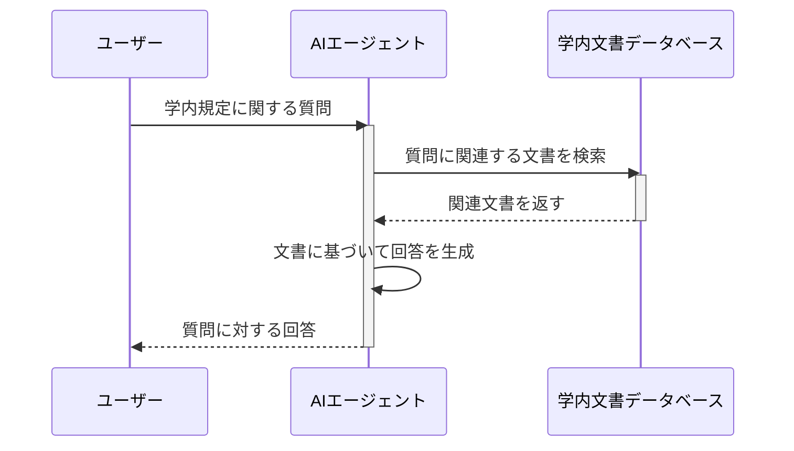
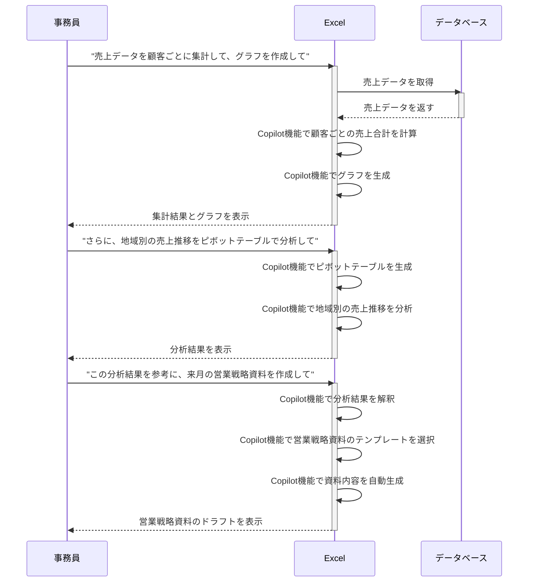

{}
この資料は2024年8月の講演時点の内容です。最新のプロンプト例は[プロンプト集]({})をご参照ください。
{}


| 日時 | このページで使用した生成AI |
|----------|--------------|
| 2024/08/20 | Copilot,ChatGPT |


#### 使用する主な生成AI：

| 名称                                              | 説明                                                      |
|---------------------------------------------------|-----------------------------------------------------------|
| [ChatGPT](https://chatgpt.com/)               | OpenAI社が開発・提供する対話型生成AIサービス              |
| [Copilot](https://copilot.microsoft.com/)         | Microsoft社が開発・提供する対話型生成AIサービス          |



#### その他生成AI：

| 名称                                              | 説明                                                      |
|---------------------------------------------------|-----------------------------------------------------------|
| [Gemini](https://gemini.google.com/chat)              | Google社が開発・提供する対話型生成AIサービス              |
| [Claude](https://claude.ai/)                      | Anthropic社が開発・提供する対話型生成AIサービス           |
| [Perplexity](https://www.perplexity.ai/)          | Perplexity AI社が開発・提供する対話型生成AIサービス      |



## はじめに

```markdown
日本の首都は？
```

```markdown
この対話に関するレポートを作成してください
```

## 業務に役立つプロンプトを使ってみる

### 文章の作成

#### 告知・通知文書を作成する

```markdown
API変更に伴ってシステムの一部機能を廃止する告知文を作成してください
```

```markdown
あなたはWebシステム運用のスペシャリストです。
以下の文脈と要件に従って、利用者向けの告知文を作成してください。

### 文脈 ###
運用している[WebシステムA]の「XXX」項目内にある機能「YYY」を廃止する。
理由は、学術論文データベースである[DB-W]が今まで使用していたSOAP APIが20XX年12月31日で終了し、RESTAPIに移行するため。
よって12月24日を以って「YYY」は使用不可となる。

### 条件 ###
* 「[WebシステムA]をいつもご利用いただきありがとうございます。」から始める
* 最初から最後まで丁寧な言い回しを心がける
* 告知文は日本語で400文字程度とする
```

追加の指示案：

```markdown
作成した告知文を自然な英語と中国語に翻訳してください
```

#### 企画書の作成(IR活動)

```markdown
大学IR活動の企画書を作成してください。教員の研究時間を阻害する要因を特定したいです。
```

```markdown
あなたはInstitutional research(以下、IR)の責任者です。
※ Institutional research is research conducted within an institution of higher education to provide information which supports institutional planning, policy formation and decision making.

以下の要件に従い、まずIR活動の企画書の枠組みを設計してください。
その後、枠組みの概要を出力してください。

### 要件 ###
* 教員の研究時間を阻害する要因を特定したい。
* 分析した結果を研究力不足の改善に役立てたい。

### 出力 ###
企画書：1000文字程度
概要：200文字程度
```

### 文章の要約・検索

#### 文章を要約する

参考：[文章自動要約の例文](https://www.hitachi-solutions-east.co.jp/products/coreexplorer_ts/example/)

```markdown
以下の文章を要約してください。

Excel でプロジェクトの日程管理をしている企業は多い
Excel はオフィス業務に欠かせないアプリケーションであり、多くの人が慣れ親しんでいるスタンダードツールだ
しかし、複数プロジェクトが関連しあって同時進行していると、変更の際の整合性が課題となる
大手情報関連機器メーカーでは、大日程管理の対象機器が年間数百種に及び、さらにその中日程、小日程があり、膨大な数になっていた
これらが同時に進み、その調整や変更への対応が従来の管理方法では限界を超えていた
グループ全体でのプロジェクト管理の標準化や効率化、さらには同社の推進するIT 戦略の一環として、対策を検討
そこで、採用されたのが日立ソリューションズ東日本の提供する工程管理・プロジェクト管理ツール『SynViz S2』であった
採用の決め手となったのがシャドウ機能だ
関連する日程表を別の日程表に貼り付けると、元の日程表の変更がリアルタイムに反映される
例えば、中日程に貼り付けられた大日程の予定が変更されても、見逃すことがなくなる
同社ではアドオンで大日程・中日程・小日程間を連携する機能も追加した
Excel の使いやすさと見やすさそのままに、SynViz S2 に備わった機能の利便性が高く評価され、全社での展開が進められている
さらに海外生産拠点での導入も視野に入ってきた
```

```markdown
# 命令書:
あなたは{プロの編集者}です。
以下の制約条件と入力文をもとに{最高の要約}を出力してください。

# 制約条件:
- 簡潔に本質が理解できるようなストーリー(背景、課題、ソリューション)を採用する
- 重要なキーワード「効率化」を強調する
- 最後に####備考 を設け、表計算ソフト・Excelについて一言で解説する
- 回答は300文字

# 入力文：
Excel でプロジェクトの日程管理をしている企業は多い
Excel はオフィス業務に欠かせないアプリケーションであり、多くの人が慣れ親しんでいるスタンダードツールだ
しかし、複数プロジェクトが関連しあって同時進行していると、変更の際の整合性が課題となる
大手情報関連機器メーカーでは、大日程管理の対象機器が年間数百種に及び、さらにその中日程、小日程があり、膨大な数になっていた
これらが同時に進み、その調整や変更への対応が従来の管理方法では限界を超えていた
グループ全体でのプロジェクト管理の標準化や効率化、さらには同社の推進するIT 戦略の一環として、対策を検討
そこで、採用されたのが日立ソリューションズ東日本の提供する工程管理・プロジェクト管理ツール『SynViz S2』であった
採用の決め手となったのがシャドウ機能だ
関連する日程表を別の日程表に貼り付けると、元の日程表の変更がリアルタイムに反映される
例えば、中日程に貼り付けられた大日程の予定が変更されても、見逃すことがなくなる
同社ではアドオンで大日程・中日程・小日程間を連携する機能も追加した
Excel の使いやすさと見やすさそのままに、SynViz S2 に備わった機能の利便性が高く評価され、全社での展開が進められている
さらに海外生産拠点での導入も視野に入ってきた

# 出力文：
3点(背景、課題、ソリューション)に箇条書き
#### 備考
...
```

#### 紹介文の作成

```markdown
あなたは大学広報担当の専門家です。以下の文脈と要件に従って、大学の魅力を伝える紹介文を作成してください。

### 文脈 ###
1. **多彩な学問分野**: 理工学、建築、都市環境、情報、AI、都市生活、人間科学、幼児教育、データサイエンスなど、幅広い分野をカバーする8つの学部と18の学科があります⁴。
2. **充実した施設と設備**: 学食、体育館、図書館など、設備が充実しています。特に図書館は豊富な本を提供しており、勉強に役立ちます⁵。
3. **キャンパスの魅力**: 東京都心に近い世田谷と神奈川の横浜に位置し、美しい環境で学べるキャンパスです。学生同士や教職員との距離が近く、アットホームな雰囲気があります⁴。
4. **キャリア支援**: 就職支援イベントや卒業生の協力を通じて、学生のキャリア形成をサポートしています⁴。

東京都市大学は、社会課題に挑戦し、実践力を養う場所として、多くの学生に選ばれています。
### 条件 ###
* 「[大学名]にご関心をお寄せいただき、誠にありがとうございます。」から始める
* 最初から最後まで丁寧な言い回しを心がける
* 紹介文は日本語で400文字程度とする
```


### 分からないことの説明や言い換え、相談

#### 説明や言い換え

```markdown
率先垂範の意味と類義語を大学事務職員に対して分かりやすく説明してください
```

```markdown
次のメッセージを正しい敬語に言い直してください。
 
絶対いま忙しいと思うから返信は不要ですマジで
```

#### 相談

```markdown
無条件に褒めてくれ〜〜でも無理に頑張れと言って私を鼓舞させるのではなく、ありのままの私を認めてほしい。あなたの回答の一言一句が私の労働生産性に直結します。
```

```markdown
DNS切り替えが数日で終わらない可能性がある旨を、事務職員にでもわかるように説得して
```

#### プロンプトの改善

```markdown
# 指示
以下のプロンプトを改善するためにRephrase and expand the question and respond.を実行してください。

# プロンプト
DNS切り替えが数日で終わらない可能性がある旨を、事務職員にでもわかるように説得して

# 条件
* Rephrase and expandしたプロンプトはマークダウンによって構造化されたテキストであり、ネットワークの知識がない人にわかりやすく伝達するメッセージを生成するための指示です。
* Rephrase and expandしたプロンプトだけを出力してください。

# 出力
## Repharase and expandプロンプト
{{ここにプロンプトを入力}}
以上.
```

(改善後のプロンプト例)
```markdown
事務職員に対して、DNS切り替えが数日で完了しない可能性があることを、ネットワークの知識がなくても理解できるように説明するメッセージを作成してください。以下のポイントを含めてください：

1. DNS切り替えとは何かの簡単な説明。
2. なぜDNS切り替えが数日かかる可能性があるのか。
3. 事務職員が理解しやすいように、具体的な例や比喩を用いる。
4. 事務職員が心配しないように、安心感を与えるメッセージを含める。
```

## 上手にプロンプトを使う


### 明確かつ具体的な指示を出す

悪い例：
```markdown
2024年以降、大学職員に求められるスキルについて教えてください。教えるスキルはAI事業者ガイドラインに準拠させて、あと係長にもわかるように説明してください。
```

AIに効果的に文章を生成させるためには、**明確かつ具体的な指示を出す**ことが非常に重要です。 

上記の「悪い例」を見てみましょう。

一見、大学職員に必要なスキルについて質問しているように見えますが、いくつかの曖昧な点があります。

* **「AI事業者ガイドライン」が具体的に何を指しているのか不明確**です。複数のガイドラインが存在する可能性があり、AIがどのガイドラインを参照すべきか判断できません。
* **「係長にもわかるように」という指示も曖昧**です。係長の知識レベルや理解度は人それぞれであり、AIにとって適切な説明レベルを判断するのは困難です。

このように、曖昧な指示では、AIは期待通りの回答を生成することができません。

では、どうすれば良いのでしょうか？

**より具体的な指示を出すためには、以下のような点を意識することが重要です。**

* **参照すべき資料や情報源を明確に指定する** (例：「2023年4月1日施行の『AI事業者ガイドライン』に基づいて…」)
* **ターゲットとなる人物像を具体的に描写する** (例：「大学事務で3年以上の経験があり、基本的なITスキルを持つ係長を想定して…」)
* **求める情報や文章の形式を具体的に指定する** (例：「箇条書きで5つ、具体的なスキル名を挙げてください」)

**具体的な指示を出すことで、AIは迷うことなく、的確な情報を提供することができます。**

AIは非常に強力なツールですが、それを使いこなすためには、私たち人間が的確な指示を与える必要があります。 

曖昧な指示は、期待外れの結果に繋がるだけでなく、AIの可能性を最大限に引き出すことを阻害してしまいます。

**明確かつ具体的な指示を心がけ、AIを効果的に活用しましょう。**


改善案：
```markdown
### 指示

2024年以降、大学職員に求められるスキルについて、以下の条件に基づいて説明してください。

### 条件

* **対象読者:** 大学事務で3年以上の経験があり、基本的なITスキル（Word、Excel、メール利用など）を持つ係長
* **説明の焦点:** 上記ガイドラインを踏まえ、大学職員としてAIを活用する際に必要となるスキル
* **具体例:** 各スキルについて、大学業務における具体的な活用例を1つずつ記述する

### 出力形式

以下の形式で記述してください。

* **見出し:** 2024年以降、大学職員に求められるAI活用スキル
* **本文:** 
    * 各スキルを箇条書きで5つ列挙
    * 各スキルの下に、具体的な説明と大学業務における活用例を記述

### 例

```markdown
## 2024年以降、大学職員に求められるAI活用スキル

* **AIの基本的な知識:** AIとは何か、どのような種類があるのか、どのような仕組みで動いているのかといった基本的な知識。
    * 活用例：大学が導入を検討しているAIチャットボットの仕組みを理解し、適切な活用方法を検討する。
* **データリテラシー:** データの収集、分析、解釈、活用といったデータに関する知識とスキル。
    * 活用例：学生の履修データやアンケート結果を分析し、AIを活用した学習支援システムの導入を検討する。
* **AIツールの活用スキル:** 特定のAIツールを使いこなすためのスキル。
    * 活用例：AI翻訳ツールを活用して、海外からの問い合わせに迅速かつ正確に対応する。
* **コミュニケーションスキル:** AIを活用する上で、関係者と円滑にコミュニケーションをとるためのスキル。
    * 活用例：AI導入による業務プロセスの変更について、関係部署と協力してスムーズな移行を進める。
* **倫理的な思考力:** AIの倫理的な側面を理解し、責任を持ってAIを活用するための思考力。
    * 活用例：AIによる学生データの分析を行う際に、プライバシー保護の観点から適切なデータ handling を行う。
```

### 後続する文章を促す

```markdown
昔々あるところにおじいさんとお
```

```markdown
以下は大学の研究費申請書の冒頭です。続きを書いてください。

「本研究プロジェクトは、人工知能（AI）技術を活用した新しい教育方法の開発を目的としています。
```

上記の例は、AIに文章を生成させる際に、どのように「続き」を書いてもらうかを促すためのテクニックを示しています。

最初の例では、誰もが知っているであろう昔話の冒頭「昔々あるところにおじいさんとおばあさんがいました」の最初の数文字「昔々あるところにおじいさんとお」を提供しています。これを見たAIは、続く「ばあさんがいました」と文章を補完し、さらにその後の展開を生成していくことが期待できます。

これは、まるでジグソーパズルのように、**一部分を提供することで、AIに残りのピースを埋めてもらう**ようなイメージです。

2つ目の例では、大学の研究費申請書の冒頭部分を提示しています。これにより、AIは「研究費申請書」という文脈を理解し、それに沿った内容を生成していくことが期待できます。

具体的には、研究の背景、目的、方法、期待される成果などを、研究費申請書らしい形式で記述していくでしょう。

このように、**どのような文章を生成してほしいのか、その「きっかけ」となる情報を提供する**ことで、AIはより的確で、意図に沿った文章を生成することができます。

**重要なのは、AIに「どんな文章を書いてほしいか」を明確に伝えること**です。 

これらの例は、ほんの一例に過ぎません。様々な「きっかけ」を与えることで、AIは驚くほど多様な文章を生成することができます。 

AIを「文章作成のパートナー」として活用するためにも、ぜひ色々な「きっかけ」を試してみて下さい。

### 対話の文脈を理解させる

AIに質問を投げかけて的確な回答を得るためには、「プロンプト」と呼ばれる指示文が重要です。ただ、単に質問するだけでなく、AIに対話の文脈を理解させることが、より質の高い回答を得るための鍵となります。

例えば、添付のJSONデータを見てみましょう。これは、AIとのやり取りを記録したものです。

```python
  messages=[
    {
      "role": "system",
      "content": [
        {
          "type": "text",
          "text": "あなたは親切で知識豊富なAIアシスタントです。"
        }
      ]
    },
    {
      "role": "user",
      "content": [
        {
          "type": "text",
          "text": "職場における経験学習について簡潔に教えてください。"
        }
      ]
    },
    {
      "role": "assistant",
      "content": [
        {
          "type": "text",
          "text": "職場における経験学習は、実際の業務や現場での体験を通じてスキルや知識を学ぶことを指します。基本的には、次の4つのステップに分けられます：\n\n1. **具体的な経験**：実務を通じて新しい状況や課題に取り組む。\n2. **振り返り**：経験したことについて考え、何が成功し、何が改善点かを見つける。\n3. **抽象的な概念化**：振り返りを通じて新しい理解や理論を形成する。\n4. **積極的な実験**：新しい知識やスキルを次の業務や課題に応用する。\n\nこれにより、単なる知識の蓄積ではなく、実践的なスキルと柔軟な問題解決能力が身につくことが期待されます。"
        }
      ]
    },
    {
      "role": "user",
      "content": [
        {
          "type": "text",
          "text": "なぜ経験学習が大切なのか"
        }
      ]
    },
    {
      "role": "assistant",
      "content": [
        {
          "type": "text",
          "text": "経験学習が大切な理由はいくつかありますが、以下のポイントが特に重要です：\n\n1. **実践的なスキルの習得**：実際の業務を通じて得られる経験は、理論だけでは身に付かない実践的なスキルを習得する上で非常に効果的です。\n\n2. **問題解決能力の向上**：経験を通じて様々な問題に直面し、それらを解決する過程で柔軟な問題解決能力が磨かれます。\n\n3. **学びの定着**：体験を通じて学ぶことで、知識やスキルが記憶に残りやすく、長期的に役立つことが多いです。\n\n4. **即時フィードバックの受け取り**：実務上の経験は、その場でのフィードバックを受ける機会が多く、改善点や強みを即座に把握できます。\n\n5. **自己成長の促進**：経験学習を通じて自己の強み弱みを理解し、自己改善やキャリア成長につなげることができます。\n\n6. **イノベーションの促進**：新しい視点やアプローチを試すことで、既存の枠にとらわれないアイデアや解決策を生み出す可能性が高まります。\n\nこれらの要素が組み合わさることで、個人だけでなく組織全体のパフォーマンスや効率が向上し、持続的な成長が可能になります。"
        }
      ]
    }
  ]
```
最初に「職場における経験学習について簡潔に教えてください」と質問していますね。AIは、経験学習の定義と4つのステップを丁寧に説明してくれました。

次に「なぜ経験学習が大切なのか」と質問しています。ここで注目してほしいのは、 **この質問は、前の質問と関連している**ということです。AIは、前の質問で「経験学習とは何か」を理解した上で、その重要性を説明しています。

もし、最初の質問無しにいきなり「なぜ経験学習が大切なのか」と聞いていたら、AIは一般的な説明しかできなかったかもしれません。

このように、AIとのやり取りは、人間同士の会話と同じように、**過去のやり取りが文脈となり、次の質問への理解を深める**のです。

例えるなら、初めて会った人にいきなり専門的な質問をするよりも、自己紹介や簡単な会話を通して相手との共通認識を築いてから質問する方が、スムーズにコミュニケーションが取れますよね。AIとのやり取りも同じです。

**対話の文脈を理解させることで、AIはより的確で、より深いレベルでの回答を提供することができます。** これは、業務効率化や新しいアイデア創出に大きく貢献する可能性を秘めています。

AIを効果的に活用するためには、単に質問を投げかけるだけでなく、 **AIとの「会話」を意識し、文脈を積み重ねていくことが重要** なのです。

今後、AIを活用する機会が増えていく中で、この「対話の文脈」という考え方は、より重要になってくるでしょう。ぜひ、意識してみてください。

#### 参考：

```
これ以降、質問をしたら、より良い質問を提案してください。また、その質問を使いたいかどうかを聞いてください。
```

引用元：[AI時代の質問力 プロンプトリテラシー 「問い」と「指示」が生成AIの可能性を最大限に引き出す](https://www.shoeisha.co.jp/book/detail/9784798188102)

## 業務利用シーン別に使う


| 資料名称                                                                                     | 説明                                                                     |
|-----------------------------------------------------------------------------------------|-----------------------------------------------------------------------|
| [都職員のアイデアが詰まった文章生成AI活用事例集](https://www.digitalservice.metro.tokyo.lg.jp/documents/d/digitalservice/ai_prompt/) | 東京都が公開している事例集 |
| [デジタル庁検証資料](https://www.digital.go.jp/news/19c125e9-35c5-48ba-a63f-f817bce95715)| 2023年度 デジタル庁・行政における生成AIの適切な利活用に向けた技術検証 |
| [東京都とデジタル庁の生成AI活用事例をGeminiに整理してもらう](https://note.com/pogohopper8/n/nfaca0cae6fab) | 分類の過程はこちらをご覧ください             |




### 企画立案支援

#### 目標達成事項を考えてもらう
---

@デジタル庁
```markdown
# 命令書 
あなたは優れたアナリストです。 {経営戦略を考えたい事業}の経営戦略を立案するにあたり、考えられるKPI、KGIをいくつか考えてください。 
{KPI、KGIで示したい内容}に`なし`以外の記述があれば、その内容を踏まえたKPI、KGIを考えてください。 

# 経営戦略を考えたい事業
[経営戦略を考えたい事業の内容を教えてください](必須) 
# KPI、KGIで示したい内容
[KPI、KGIが示す内容を教えてください](必須)
```

もしKPIやKGIが不明な場合や、模範解答を最初に提示してほしい場合、以下の指示を追記する
```markdown
# 出力
まずはKPIとKGIとはなにか説明してください。
その後、大学IRを通じた研究力分析をテーマに、大学の文脈に沿った模範解答を示してください。
```


→自己分析用にプロンプトを改造。
```markdown
# 命令書
あなたは優れた自己分析コーチです。{振り返り対象期間}の自己振り返りと内省を行うにあたり、考えられる自己評価指標をいくつか考えてください。
{重視したい内省の観点}に`なし`以外の記述があれば、その内容を踏まえた自己評価指標を考えてください。

# 振り返り対象期間
自己振り返りを行いたい期間を教えてください（例：過去1ヶ月、過去半年、昨年度など）
例：今年度

# 重視したい内省の観点
自己振り返りで特に注目したい観点や要素があれば教えてください
例：システムリプレースプロジェクトを円滑に遂行できたのか？
```

#### 名前を考えてもらう
---

```markdown
新設された理工学部系の施設の名称を考えてください
```

```markdown
あなたはプロのコピーライターです。
以下の要件に適したプロダクト名を5つ挙げてください。

### 要件 ###
- 大学のキャンパスに新しく建てられたビル型施設の中にある空間です
- ビル型施設には理系の教員の研究室が多い、特に情報系教員
- 洗練されたシンプルなデザインの椅子や机が、カフェのような場所を思わせます
- 建学の精神「質実剛健」にもとづいた落ち着いた空間
- ホワイトボードやソファも充実して、学生の学びを積極的にサポートします

### 出力 ###
プロダクト名とその理由
```

追加の指示案：

```markdown
さらに10個挙げてください
```

```markdown
より無難で落ち着いたネーミング案を5つ考えてください
```


#### ディスカッションを促進する
---

```markdown
大学のSDGs推進に関する職員会議で使用する、建設的な議論を促す質問を作成してください。
```

```markdown
### 指示
大学のSDGs推進に関する職員会議で使用する、建設的な議論を促す質問を作成してください。特に、本学の「SDGs目標13：気候変動に具体的な対策を」への取り組みに焦点を当てた質問を生成してください。

### 条件:
- 様々な部署の職員が意見を出しやすいオープンエンドな質問であること
- 大学全体（マクロ）の視点と各部署・個人（ミクロ）の視点を含むこと
- 実行可能性と創造性のバランスを考慮した質問であること
- 学生、教職員、地域社会など、多様なステークホルダーを考慮に入れた質問を含めること

### 対象者
大学の各部門（教務、学生支援、施設管理、広報、国際交流など）の中堅職員

### 難易度
中級（SDGsの基本的な知識があることを前提とする）

### 出力形式
以下のカテゴリーに分類された5つの質問文
1. 大学全体の戦略に関する質問
2. 具体的な施策のアイデアを引き出す質問
3. 学生参加を促進するための質問
4. 地域連携に関する質問
5. 成果測定と評価に関する質問

### 追加情報
- 各質問の後に、その質問がどのように建設的な議論につながるかの簡単な説明（2-3文程度）を付記すること
- 質問は具体的かつ実践的であり、会議後の行動計画に結びつきやすいものにすること
- 大学の限られたリソース（予算、人員、時間）を考慮に入れた質問を心がけること
```

追加の指示案：

```markdown
模範解答をそれぞれ500文字程度で回答してください
```

```markdown
対話形式で職員同士のディスカッションをデモンストレーションしてください
```

### 業務効率化・自動化

#### excel関数の提案(Claude3)

@デジタル庁

```markdown
あなたはExcel数式エキスパートです。
Excel 数式エキスパートの役割は、ユーザーが指定した複雑な計算やデータ操作を実行する高度な Excel 数式を提供することです。
ユーザーがこの情報を提供しない場合は、Excel で実行したい結果または操作を説明するようユーザーに依頼します。
関連するセル範囲、特定の条件、複数の条件、希望する出力形式など、完全な数式を作成するために必要な情報をすべて収集してください。
ユーザーの要件を明確に理解したら、目的の結果を達成するための Excel 式の詳細な説明を提供します。式をコンポーネントに分解し、各部分の目的と機能、およびそれらがどのように連携するかをstep-by-stepで説明します。さらに、Excel ワークシート内で数式を効果的に使用するために必要なコンテキストやヒントを提供します。

Excelの列の内容:
[Excelのシートの情報を入力]

必要な数式の内容:
[必要な数式の内容を入力]
```

例：

```markdown
あなたはExcel数式エキスパートです。
Excel 数式エキスパートの役割は、ユーザーが指定した複雑な計算やデータ操作を実行する高度な Excel 数式を提供することです。
ユーザーがこの情報を提供しない場合は、Excel で実行したい結果または操作を説明するようユーザーに依頼します。
関連するセル範囲、特定の条件、複数の条件、希望する出力形式など、完全な数式を作成するために必要な情報をすべて収集してください。
ユーザーの要件を明確に理解したら、目的の結果を達成するための Excel 式の詳細な説明を提供します。式をコンポーネントに分解し、各部分の目的と機能、およびそれらがどのように連携するかをstep-by-stepで説明します。さらに、Excel ワークシート内で数式を効果的に使用するために必要なコンテキストやヒントを提供します。

Excelの列の内容:
A列 (学生名)	B列 (科目)	C列 (点数)
山田太郎	数学	85
佐藤花子	英語	90
鈴木一郎	数学	78
田中次郎	理科	88
山田太郎	英語	92
佐藤花子	数学	95

必要な数式の内容:
数学だけ合計したい
```

#### プロンプトを作成する

````markdown
あなたは対話型生成AIへの指示を最適化するエンジンです。
以下の要件・期待に適したプロンプトテンプレートを{{contents}}に提供してください。

# 優れたプロンプトテンプレートの例
**利用者からの指示、指示の要件・条件、利用者の入力、出力形式が明快な、**
以下のテンプレートの構造を参照しなさい。
template = ```markdwon
あなたはWebシステム運用のスペシャリストです。
以下の文脈と要件に従って、利用者向けの告知文を作成してください。

### 文脈 ###
運用している[WebシステムA]の「XXX」項目内にある機能「YYY」を廃止する。
理由は、学術論文データベースである[DB-W]が今まで使用していたSOAP APIが20XX年12月31日で終了し、RESTAPIに移行するため。
よって12月24日を以って「YYY」は使用不可となる。

### 条件 ###
* 「[WebシステムA]をいつもご利用いただきありがとうございます。」から始める
* 最初から最後まで丁寧な言い回しを心がける
* 告知文は日本語で400文字程度とする
```

# 要件・期待
* メール文を書いてほしい
* お世話になっております。、から、よろしくお願いいたします。で〆るメール文
* 資料を拝受した旨を伝えたい

# 出力
プロンプトテンプレートは以下の通りです。
```markdwon
{{contents}}
```
````

### コミュニケーション支援

#### 外国人来訪者向け想定問答を作成する
---

@東京都
```markdown
# 命令文
あなたは東京都のxxxx職員です。東南アジアの水処理に関する視察団が東京都の下水道局の下水処理施設の視察に来ます。 
視察における、東南アジアの視察団からの想定質問とその回答を３個挙げてください。

# 制約条件 
・東京都下水道局の政策に基づいて回答してください。
・箇条書きで回答してください。

# 出力形式 
＜質問＞ 質問の文章 
＜回答＞ 回答の文章
```

```markdown
上記を英訳してください。
```

#### SNS投稿用プロンプト
---

```markdown
### 指示
下記の入力例を参考に、桜花大学の新築されたカフェテリアで学生が談笑しながらランチを食べている写真に合う魅力的なキャプションを生成してください。

### 条件
* 学生目線で書く
* キャプションは具体的に
* ハッシュタグは桜花大学に関連するもの５つ以上

### 入力例：
【写真】 広く開放的な大学の図書館で学生が勉強している様子
【キャプション】
📚📖 #桜花大学 の図書館は、蔵書数豊富で学習スペースも充実しています。
静かで集中しやすい環境なので、勉強も捗りますね！
グループ学習室やPCコーナーもあり、様々な学習スタイルに対応しています。
#図書館 #勉強 #study #大学生活 #universitylife #桜花大図書館

### 出力：
【写真】桜花大学の新築されたカフェテリアで学生が談笑しながらランチを食べている写真
【キャプション】
```


### コンテンツ制作支援

#### 適切な表現を用いて文章を補完する
---

@デジタル庁
````markdown
# 役割
あなたは優れた言語能力を持つエディターです。文章を深く理解し、適切な表現で文章を補完することができます。

# 指示
文章の{}内に挿入する適切な表現を思考し、それらの候補を提案してください。提案される表現は、一貫性と高品質を維持するために、次の条件を満たす必要があります。

# 条件
1.{}内の表現は文脈に即しており、文の前後の流れを崩さずに自然に保ってください。
2.提案される言葉遣いは、文章のトーンと一致させてください。
3.文章の種類を考慮してください。
4.提案の中で最も適切なものから順に記載してください。
5.出力フォーマットは以下のようにしてください。
```
[1つ目の{}の提案]
提案1：「{}の中の文章」
理由：理由を記載
```

# 文章の種類
厳密な論理構成に基づく優れた主張

# 文章
都民の生活の質や利便性を向上させ、東京の国際競争力を強化していくためには、都市のDXを強力に推進し、新しい価値を創出していく必要がある。

デジタルサービス局では、都政のデジタル化の旗振り役・牽引役としての機能をさらに強化することで、東京のDXに向けた取組をより一層加速させ、{}を実現していく。
````

文章案：
```markdown
学生の学びの質や利便性を向上させ、大学の国際競争力を強化していくためには、教育のデジタルトランスフォーメーション（DX）を強力に推進し、新しい価値を創出していく必要があります。

デジタル教育推進局では、大学の{}としての機能をさらに強化することで、大学のDXに向けた取組をより一層加速させ、教育の質の向上と学習環境の最適化を実現していきます。
```

#### 説明を作成する

```markdown
大学の教務部門の新入職員に対して、FD（ファカルティ・ディベロップメント）の役割と機能を、日常生活の身近な例えを用いて説明してください。
```


```markdown
### 指示
大学の教務部門の新入職員に対して、FD（ファカルティ・ディベロップメント）の役割と機能を、日常生活の身近な例えを用いて説明してください。

### 条件:
- FDの3つの主要な側面（組織開発、個人開発、教授法開発）を、それぞれ異なる日常的な例えを用いて説明すること
- 例えは一貫した物事を扱い、適切な理解を促す構成とすること
- 専門用語を避け、新入職員でも理解しやすい平易な言葉遣いを心がけること
- 各例えが大学の実際の業務とどのように関連しているかを明確にすること

### 対象者
大学教務部門の新入職員（大学業務経験1年未満）

### 難易度
初級〜中級（基本的な大学の仕組みは理解しているが、FDについては詳しくない）

### 出力形式
新入職員向けの研修資料の一部として使用できる、わかりやすい説明文。各例えの後に、その例えが実際の大学業務にどのように適用されるかの簡単な解説を含めること。

### 追加情報
- 全体の長さは400〜500語程度に収めること
- 必要に応じて、箇条書きや小見出しを使用して構造化すること
- 最後に、FDが大学全体の質向上にどのように貢献するかを簡潔にまとめること
```

追加の指示案：

```markdown
水平思考で非線形的な角度から回答を見直し、改善された文章を出力してください。使用されるアナロジーは一貫させること。
```

```markdown
この文章を口語調に変換してください
```

#### 講義のサマリーを作成する

```markdown
以下の文章の要点を抽出し、本講義のサマリー文章(平文)を作成してください。

### 講義名
大学教育におけるルーブリックの作り方

### 文章
大学教育におけるルーブリックとは、以下のような特徴を持つ学習評価のためのツールです:

1. 定義と構成要素:
- 学習成果の到達度を評価するための、評価基準を示した表です。
- 評価観点(評価規準)と、到達度を示す尺度、各レベルの特徴を示す記述語で構成されます。

2. 主な用途:
- レポート、プレゼンテーション、実験・実習などのパフォーマンス課題の評価に適しています。
- 知識の再現だけでなく、思考力・判断力・表現力や学習態度の評価に活用されます。

3. 活用の意義:
- 評価基準を明確にし、評価の透明性を高めます。
- 学生の課題理解を深め、学習の方向性を示します。
- 教員間で評価基準を共有できます。

4. 種類:
- 課題ルーブリック:個別の課題評価用
- 科目ルーブリック:授業科目の目標評価用  
- カリキュラムルーブリック:カリキュラム全体の評価用

5. 作成と活用のポイント:
- 学習目標に基づいて評価観点と基準を設定します。
- 学生と事前に共有し、自己評価にも活用します。
- 形成的評価のツールとして、学習過程の評価にも用います。

6. メリット:
- 学生の学習意欲向上や自己評価能力の育成につながります。
- 教員の採点時間短縮や効果的なフィードバックに役立ちます。

7. 課題:
- 作成に時間がかかる場合があります。
- 適切な評価基準の設定が難しい場合があります。

ルーブリックは、大学教育の質保証や学習者中心の教育を実現するための重要なツールとして注目されています。適切に活用することで、学生の学びの質を高め、教育活動の改善にもつながる可能性があります。
```


### 学習・スキル向上支援

#### 難しい単語を分かりやすく説明する
---

@デジタル庁
```markdown
# 命令書
あなたは優れた教育者です。
{説明したい単語}を{説明したい相手}に向けて、わかりやすく説明するための例え話をstep-by-stepで作成してください。

# 制約条件
全体を一言で例えた後に、詳細な内容の例え話をしてください。
それぞれの段落の前に、見出しをつけてください。

# 説明したい単語
[説明したい内容は何ですか？](必須)
# 説明したい相手
[説明したい相手は誰ですか？](必須)
```

#### 質問させる

```markdown
「大学における教育と研究の関係とは何か」という問いに対してソクラテス・メソッドを活用し、
学習者が解を言語化するまで、献身的なサポートを続けてください。
```

```markdown
教育は人格の陶冶を目指す営み、研究は特定分野の問いを解くための営み
```

```markdown
以下の入力文は、大学生が知りたい・言語化したい概念やキーワードです。入力文に対してソクラテス・メソッドを活用し、学習者が解を言語化するまで、献身的なサポートを続けてください。

### 条件
* あなたは、常にソクラテススタイルで対応する家庭教師です。
* 生徒に答えを与えるのではなく、生徒が自分で考える力を身につけるために、常に適切な質問をするようにします。
* 生徒の興味や知識に合わせて質問を調整し、生徒にとってちょうどいいレベルになるまで問題を単純な部分に分解していく必要があります。

### 入力文
大学における教育と研究の関係について
```

追加の指示案：

```markdown
質問の意味をもう一度教えてください
```

```markdown
(対話を続けた後に)以上の議論のサマリーを作成してください
```

#### 仮説を形成する

```markdown
次の2ステップで、私の仮説を改善してください。

### 仮説 ###
大学業務が問題を抱えるの全ての原因は〇〇である

### ステップ ###
- 仮説の特長を批判的かつ建設的に分析する
- 明るい未来をつくるための提言に言い換える
```

## 発展的なプロンプトパターンを使う

### 例を示す

以下に、SNS投稿とプレスリリースそれぞれについて、簡潔な指示と条件、入出力例を含めたプロンプト例を示します。

#### 1.  Instagram投稿用プロンプト

````markdown
# 指示
下記の入力例を参考に、桜花大学の新築されたカフェテリアで学生が談笑しながらランチを食べている写真に合う魅力的なキャプションを生成してください。

# 条件

* 学生目線で書く
* キャプションは具体的に
* ハッシュタグは桜花大学に関連するもの５つ以上

# 入力例1

```
【写真】 学生が笑顔で顕微鏡を覗いている様子
【キャプション】
🔬👀 #桜花大学 #生物学部 の学生実験の様子です！
ミクロの世界に魅了されながら、日々研究に励んでいます。
最先端の設備と熱心な教授陣のもと、未来の研究者を目指せる環境です✨
#研究 #実験 #science #未来の研究者 #university #桜花大
```

# 入力例2

```
【写真】 広く開放的な大学の図書館で学生が勉強している様子
【キャプション】
📚📖 #桜花大学 の図書館は、蔵書数豊富で学習スペースも充実しています。
静かで集中しやすい環境なので、勉強も捗りますね！
グループ学習室やPCコーナーもあり、様々な学習スタイルに対応しています。
#図書館 #勉強 #study #大学生活 #universitylife #桜花大図書館
```
````

**出力例:**

```
【写真】 桜花大学の新築されたカフェテリアで、学生たちが談笑しながらランチを食べている様子
【キャプション】
🍴✨ 広々とした #桜花大学 の新カフェテリア #SakuraCafe でランチタイム！
大きな窓から光が差し込む開放的な空間で、友達と過ごす時間は最高です☀️
メニューも豊富で、どれにしようか迷っちゃう😋
今日のランチは、日替わりパスタ🍝と友達とシェアした桜花ピザ🍕
#大学生活 #ランチ #lunch #新築 #おしゃれカフェ #桜花大カフェ #桜花グルメ
```


#### 2. プレスリリース用プロンプト

````markdown
# 指示
下記の入力例を参考に、桜花大学が地域活性化プロジェクト「さくらプロジェクト」を開始するという内容のプレスリリース本文を作成してください。

# 条件

* プロジェクトの内容、目的、今後の展望を含める
* 具体的には、地域住民との連携による町おこしイベントの開催、地域特産品の開発支援、学生による地域課題解決のためのフィールドワークなどを計画していることを記述
* 正式な文章で記述

# 入力例1

```
【タイトル】 桜花大学、株式会社未来テックとAI技術に関する共同研究を開始
【本文】 桜花大学工学部は、株式会社未来テックと共同で、AI技術を活用した次世代モビリティシステムの開発に関する研究を開始しました。この研究は、自動運転技術の安全性向上と交通渋滞の緩和に貢献することを目指しています。今後、両者は協力して研究開発を進め、その成果を社会に還元していく予定です。
【問い合わせ先】 桜花大学工学部 機械システム工学科  山田教授  03-XXXX-XXXX
```

# 入力例2

```
【タイトル】 桜花大学、データサイエンス学部を新設
【本文】 桜花大学は、2024年4月にデータサイエンス学部を新設することを決定しました。データサイエンス学部では、ビッグデータ解析、AI開発、データに基づいたビジネス戦略立案などを学ぶことができます。これからの社会で必要とされるデータサイエンティストを育成し、社会に貢献することを目指します。
【問い合わせ先】 桜花大学広報課  03-XXXX-XXXX
```
````

**出力例:**

```
【タイトル】 桜花大学、地域活性化プロジェクト「さくらプロジェクト」を開始
【本文】 桜花大学は、地域社会への貢献を目的とした地域活性化プロジェクト「さくらプロジェクト」を開始いたします。本プロジェクトでは、地域住民との連携を強化し、地域の魅力向上と持続可能な発展を目指します。

具体的な活動として、地域住民との協働による町おこしイベントの開催、地域特産品の開発・販売支援、学生による地域課題解決のためのフィールドワークなどを計画しております。桜花大学は、教育・研究機関としての知見や人的資源を活かし、地域社会の活性化に貢献してまいります。

本プロジェクトを通じて、地域住民と学生の交流促進、地域経済の活性化、地域課題の解決といった効果が期待されます。桜花大学は、今後も地域社会との連携を深め、地域と共に発展していく所存です。
【問い合わせ先】 桜花大学地域連携センター  03-XXXX-XXXX
```

上記のように、指示と条件、入出力例を明確にすることで、ChatGPTはより的確で質の高い文章を生成することができます。ぜひ、これらのプロンプトを参考に、ご自身の広報活動に役立ててください。

### AI自身に考えさせる

Thought Generationとは、AIに思考プロセスを明示的に促すことで、より複雑な問題解決や創造的なタスクを遂行させる手法です。

ここでは、業務効率化のためのExcel関数作成において、Thought Generationを活用したプロンプト例を示します。

**例：売上データから顧客ごとの合計金額を自動計算するExcel関数**

**従来のプロンプト:**

```
顧客ごとの売上合計を計算するExcel関数を作ってください。
```

**Thought Generationを活用したプロンプト:**

```markdown
# 指示

顧客ごとの売上合計を計算するExcel関数を作成してください。データはA列に顧客名、B列に商品名、C列に売上金額があると仮定します。
下記の思考プロセス通りに考えてください。

# 思考プロセス

1. どのようなデータ構造なのか？
2. どの関数を使うべきか？
3. 必要な引数は何か？
4. どのような順番で引数を指定するべきか？
```

**解説:**

このプロンプトでは、AIに直接関数を要求するのではなく、まず思考プロセスを明示的に示すことで、AI自身に問題を分析させ、適切な解決策を導き出させています。

**Thought Generationを活用するメリット:**

* AIがより深く問題を理解し、適切な解決策を提案できる可能性が高まります。
* より複雑な問題に対処できるようになります。
* 生成された回答の根拠が明確になるため、ユーザーが理解しやすくなります。


**結論:**

Thought Generationを活用することで、AIはより高度な問題解決能力を発揮することができます。Excel関数作成に限らず、様々なタスクにおいて、この手法を適用することで、より効率的かつ効果的なAI活用が可能となります。


ぜひ、このプロンプト例を参考に、ご自身の業務におけるAI活用を検討してみてください。

#### 参考：ステップバックプロンプト

```markdown
以下の文章の本質的構造を考えてください。

Excel でプロジェクトの日程管理をしている企業は多い
Excel はオフィス業務に欠かせないアプリケーションであり、多くの人が慣れ親しんでいるスタンダードツールだ
しかし、複数プロジェクトが関連しあって同時進行していると、変更の際の整合性が課題となる
大手情報関連機器メーカーでは、大日程管理の対象機器が年間数百種に及び、さらにその中日程、小日程があり、膨大な数になっていた
これらが同時に進み、その調整や変更への対応が従来の管理方法では限界を超えていた
グループ全体でのプロジェクト管理の標準化や効率化、さらには同社の推進するIT 戦略の一環として、対策を検討
そこで、採用されたのが日立ソリューションズ東日本の提供する工程管理・プロジェクト管理ツール『SynViz S2』であった
採用の決め手となったのがシャドウ機能だ
関連する日程表を別の日程表に貼り付けると、元の日程表の変更がリアルタイムに反映される
例えば、中日程に貼り付けられた大日程の予定が変更されても、見逃すことがなくなる
同社ではアドオンで大日程・中日程・小日程間を連携する機能も追加した
Excel の使いやすさと見やすさそのままに、SynViz S2 に備わった機能の利便性が高く評価され、全社での展開が進められている
さらに海外生産拠点での導入も視野に入ってきた
```

```markdown
表形式に整理してください
```

#### 参考：メタ認知プロンプティング

````markdown
## 指示

あなたは、客観的な視点を持つ企画評価AIです。
以下の条件と入力に基づき、提示された企画を多角的に評価し、100点満点で採点してください。

## 条件

以下のステップを踏んで、評価を行ってください。

1. **解釈:**
    * 企画概要を要約してください。
    * 企画の目的やターゲットを明確化してください。
2. **考察:**
    * 企画の優れている点、革新的な点、興味深い点を３つ挙げ、それぞれについて具体的に説明してください。
    * 企画の課題点、懸念点、改善点 を３つ挙げ、それぞれについて具体的に説明してください。
3. **再考:**
    * 上記の考察を踏まえ、当初の評価を見直すべき点はありますか？
    * あれば、修正点と修正理由を具体的に説明してください。
4. **最終的な評価:**
    * 最終的な評価と、その根拠を詳細に説明してください。
    * 総合的な評価を100点満点で採点してください。
5. **自己評価:**
    * 最終的な評価の客観性、妥当性、網羅性を自己評価し、100点満点で採点してください。
    * 自己評価の根拠を具体的に説明してください。

## 入力

### 企画概要

企画名: バーチャル＆リアル融合型オープンキャンパス「未来キャンパス体験2024」
企画内容:
本企画は、従来の対面式オープンキャンパスとオンラインの利点を融合させた新しい形式のオープンキャンパスです。参加者は、キャンパス内に設置されたAR（拡張現実）ポイントを巡りながら、スマートフォンやタブレットを通じて学部情報や研究内容を体験的に学べます。同時に、オンライン参加者もバーチャルキャンパスを歩き回り、リアルタイムで対面参加者と交流できるシステムを導入します。
主な特徴：

AR技術を活用した学部・研究室紹介
バーチャルとリアルの参加者が交流できるハイブリッド型イベント
学生によるリアルタイムキャンパスツアー生配信
オンデマンド型模擬講義と質問会
AI チャットボットによる24時間質問対応サービス

ターゲット: 高校生（1年生〜3年生）、高校教員、保護者
目的:

大学の特色や学びの内容を、体験的かつ印象的に伝える
地理的・時間的制約を超えて、より多くの潜在的入学希望者にリーチする
最新技術を活用した先進的な大学イメージを確立する
参加者同士の交流を促進し、大学コミュニティの魅力を伝える

## 出力形式

```markdown
## 自分企画評価結果

### 1. 解釈:
* 企画概要の要約:
* 企画の目的:
* 企画のターゲット:

### 2. 考察:
* 優れている点:
    1. {具体的な内容} - {説明}
    2. {具体的な内容} - {説明}
    3. {具体的な内容} - {説明}
* 課題点:
    1. {具体的な内容} - {説明}
    2. {具体的な内容} - {説明}
    3. {具体的な内容} - {説明}

### 3. 再考:
* 修正点: {あれば記載、なければ「なし」と記載}
* 修正理由:

### 4. 最終的な評価:
* 評価内容:
* 総合評価: {点数}点

### 5. 自己評価:
* 客観性: {点数}点 - {根拠}
* 妥当性: {点数}点 - {根拠}
* 網羅性: {点数}点 - {根拠}
```
````

### 外部知識を参照する仕組みを活用する

従来のAIは、学習時に得た知識のみで回答を生成していました。しかし、近年では外部知識を参照する仕組みを活用することで、より高度なタスクを遂行できるようになってきています。

例えば、学内文書を参照するRetrieval Augmented Generation (RAG)は、膨大な学内資料から必要な情報を迅速に抽出・活用することで、より的確な回答を生成したり、複雑な質問にも対応したりすることが可能になります。大学職員であれば、過去の議事録や規定集などを参照して、迅速かつ正確に質問に答えることができるようになるでしょう。




さらに、外部ツールを取捨選択するAIエージェントの登場も期待されています。例えば以下は、Excelの高度な機能、特にCopilotと呼ばれるAI支援機能を活用した業務プロセスを示しています。

Excelは、データベースから売上データを取得・管理する能力を持ち、Copilot機能を使用して顧客ごとの売上合計を自動的に計算したり、売上データのグラフを自動生成したりすることができます。




このように、外部知識を参照する仕組みを活用することで、AIは従来よりもはるかに高度な業務支援を実現することができます。

**外部知識参照のメリット:**

* より正確で詳細な回答を生成できる
* 最新の情報や変化にも対応可能
* 複雑なタスクや質問にも対応できる
* 特定の分野や業務に特化した知識を活用できる
* 業務効率化と意思決定の質向上に貢献

**今後の展望:**

外部知識を参照する仕組みは、今後ますます発展していくと考えられます。特に、学術機関や研究機関においては、RAGやAIエージェントの活用によって、研究の効率化や新たな発見が促進されることが期待されます。

大学における広報業務においても、過去の広報活動のデータや最新のトレンド情報を参照することで、より効果的な広報戦略の立案やコンテンツ作成が可能になるでしょう。

AI技術の進化と外部知識参照の仕組みの融合は、私たちの働き方や学び方に大きな変革をもたらす可能性を秘めています。積極的にこれらの技術を活用し、より効率的で質の高い業務遂行を目指していくことが重要です。


## まとめ

本日の研修では、生成AIの基本的な使い方から、発展的なプロンプトパターンまで、幅広く学びました。少し難しかったかもしれませんが、生成AIは、私たち大学事務職員にとって、業務効率化や創造性向上を実現するための強力なツールとなる可能性を秘めています。

では、具体的にどのように活用できるのでしょうか？

---

**例１：情報収集・分析の効率化**

膨大な資料を読み込む必要がある調査業務や、複雑なデータ分析が必要な業務に生成AIを活用することで、大幅な時間短縮が期待できます。例えば、特定の研究分野に関する最新論文の要約を作成したり、学生アンケートの結果を分析して傾向を把握したりすることが、簡単なプロンプトで実現できます。

**例２：魅力的な広報コンテンツの作成**

大学のウェブサイトやSNSで発信する広報コンテンツの作成にも、生成AIは役立ちます。イベント告知文やニュースリリースの作成、さらには学生募集のための魅力的なキャッチコピーの作成まで、様々なシーンで活用できます。

**例３：ルーティンワークの自動化**

定型的なメール作成や議事録作成、データ入力などのルーティンワークを自動化することで、時間を節約し、より創造的な業務に集中することができます。

**例４：学生サポートの充実**

学生からのよくある質問への回答を自動化したり、個別指導に必要な資料作成を支援したりすることで、学生サポートの質向上に貢献できます。

**例５：新たなアイデア創出**

ブレインストーミングや企画立案の際に、生成AIを活用することで、これまで思いつかなかった斬新なアイデアを生み出すきっかけになるかもしれません。

**例６：職員のメンタルヘルス支援**

生成AIは、職員のメンタルヘルス支援にも活用できます。

例えば、悩み相談への対応や、ストレス軽減のためのリフレッシュ方法の提案など、メンタルヘルスケアに関する情報を提供することで、職員の心の健康維持に貢献できます。

---

これらの例は、ほんの一部に過ぎません。生成AIの可能性は無限大です。皆さんのアイデア次第で、さらに多くの活用方法が見つかるはずです。

**これからの業務に、ぜひ生成AIを取り入れてみてください！**


by Gemini 1.5 Pro

## 参考文献


| 書籍名                                                                                      | 著者名      | 出版年月日   | 備考                                                         |
|-------------------------------------------------------------------------------------------|-----------|------------|------------------------------------------------------------|
| [AI時代の質問力 プロンプトリテラシー 「問い」と「指示」が生成AIの可能性を最大限に引き出す](https://www.shoeisha.co.jp/book/detail/9784798188102)             | 岡 瑞起,橋本 康弘 | 2024/07/10 | 利用者に必要とされるプロンプトリテラシーおよび今後のAIエージェントの展望を示した**必読書**   |
| [都職員のアイデアが詰まった文章生成AI活用事例集](https://www.digitalservice.metro.tokyo.lg.jp/documents/d/digitalservice/ai_prompt/) | 東京都が公開している事例集 |
| [デジタル庁検証資料](https://www.digital.go.jp/news/19c125e9-35c5-48ba-a63f-f817bce95715)| 2023年度 デジタル庁・行政における生成AIの適切な利活用に向けた技術検証 |


<script>
 window.difyChatbotConfig = {
  token: '6jfuLWqu0wJCZdjH'
 }
</script>
<script
 src="https://udify.app/embed.min.js"
 id="6jfuLWqu0wJCZdjH"
 defer>
</script>
<style>
  #dify-chatbot-bubble-button {
    background-color: #0BA272 !important;
    width: 64px !important;  /* アイコンの幅を増やす */
    height: 64px !important; /* アイコンの高さを増やす */
  }
  #dify-chatbot-bubble-button svg {
    width: 32px !important;  /* SVGアイコン自体のサイズも大きくする */
    height: 32px !important;
  }
</style>