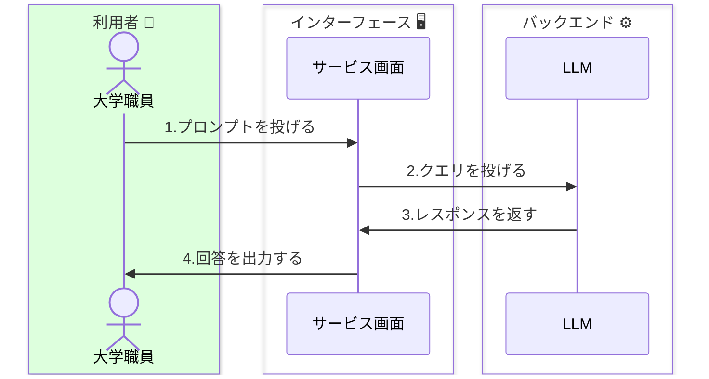
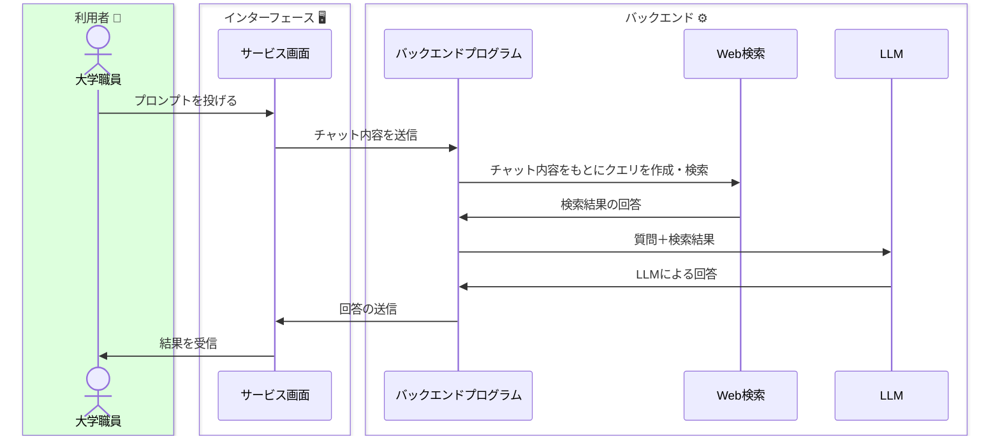
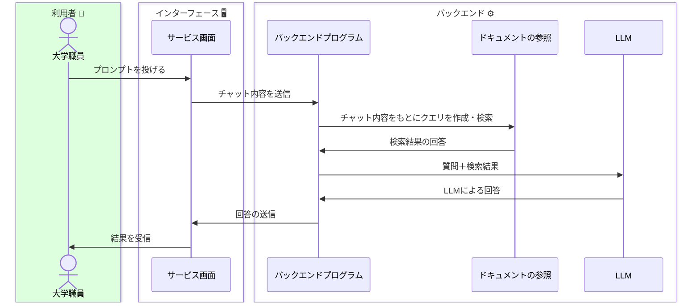
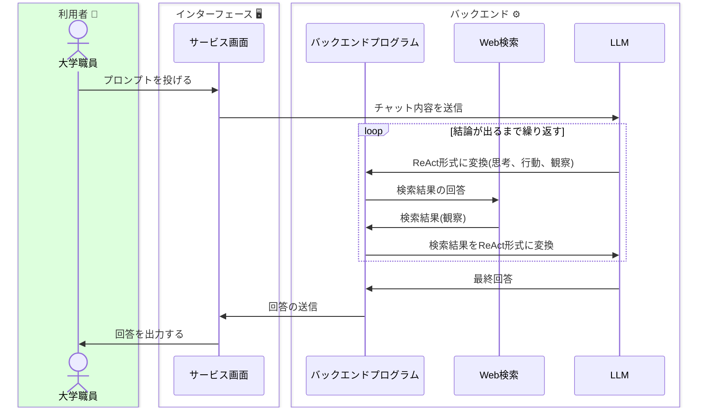
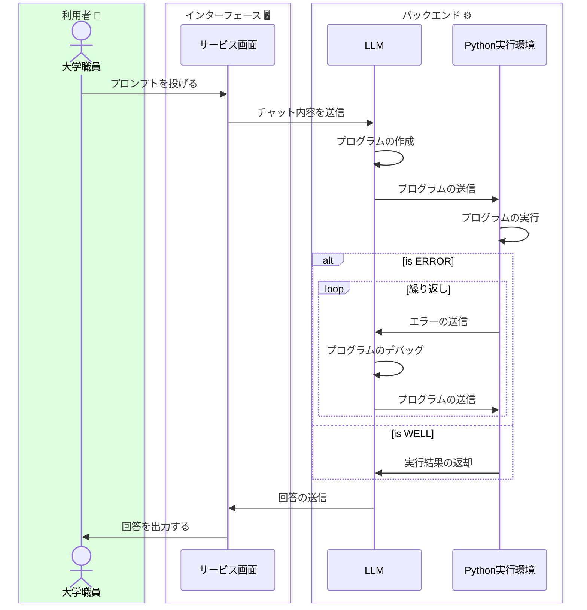





ChatGPTの中で使用されてるAIモデル(GPT-3.5やGPT-4)が[WebAPIで公開](https://openai.com/blog/introducing-chatgpt-and-whisper-apis)されており、従量課金制で誰でも利用できます。ChatGPTだけではなくClaudeやGeminiもWebAPIを公開しています。WebAPIを叩けると、技術者が泣いて喜びます。なぜならChatGPT内部のAIモデルを別のサービスやシステムに組み込むことができるからです。<strong>その最たる例がMicrosoftのCopilot(旧Bing AI)です。</strong>従来の検索エンジンにLLMを使用することで、Webサイトの情報を利用者へ素早く・分かりやすく提供しています。


そのほか、こうした「AIモデルを組み込んだサービス」は[星の数](https://aismiley.co.jp/ai_news/generativeai-chaosmap/)ほどあります。そのすべてを紹介することはできませんので、メジャーな生成AIサービスの類型を紹介します。

## 🗂️ 生成AIサービスの類型
---
<br>

### - 基本型
#### LLM[外部ツール無し]
例：ChatGPT(無料版)、Claude

Web検索に対応していない生成AIサービスです。このほか、例えば会議の議事録を要約するサービスが該当します。




<br>

### - 検索エンジン型
#### LLM+Web検索
例：Copilot(旧Bing AI)、Bard、Perprexity

検索エンジンが搭載された生成AIサービスです。無料で高性能なAIモデルを活用できるケースも多いため、ChatGPTではなくこちらを積極的に活用している方もいます。



<br>


### - ナレッジ参照型
#### LLM+ドキュメント
例：窓口応答システム、社内文書システム等

無料かつWeb公開されているサービスではほぼ見られませんが、LLMの訓練データを超えたデータを埋め込むタイプの生成AIサービスがあります。特に一般向け・社内向けに整備されたものが多い印象です。




<br>


### - 自律エージェント型(1)
#### LLM+Web検索+ReAct
例：AutoGPT

LLMを活用して自律エージェントを実装した例も見られます。これは一例で、現在も開発が活発だと見受けられます。



<br>


### - 自律エージェント型(2)
#### LLM+Python実行環境
例：Code Interpreter、Open Interpreter

ChatGPT Plus加入者であれば身に覚えのある「Code Interpreter」や、その欠点を補うオープンソースソフトウェア「Open Interpreter」が該当します。自然言語のプロンプトを投げるだけでプログラムの作成・実行・デバッグを行う優れものです。




<!-- 
### 今後の生成AIサービス
```mermaid
sequenceDiagram
    box 利用者
    actor 大学職員
    end
    box AIエージェント
    participant エージェント画面
    participant サービス画面
    participant LLM
    end
    大学職員->>エージェント画面: プロンプトを投げる
    エージェント画面->>サービス画面: 必要なサービスを選択し、クエリを投げる
    サービス画面->>LLM: クエリを投げる
    LLM->>サービス画面: レスポンスを返す
    サービス画面->>エージェント画面: 回答を返す
    エージェント画面->>大学職員: 回答を出力する

``` -->


## 📚 参考文献
https://speakerdeck.com/hirosatogamo/chatgpt-azure-openai-da-quan?slide=29