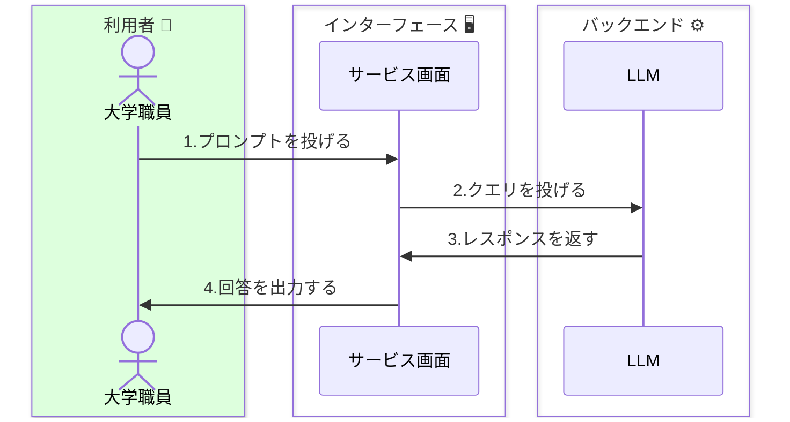
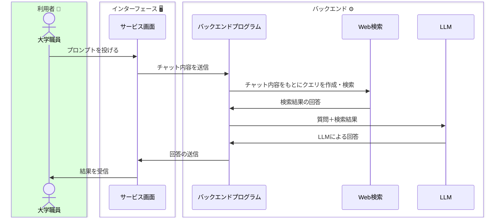
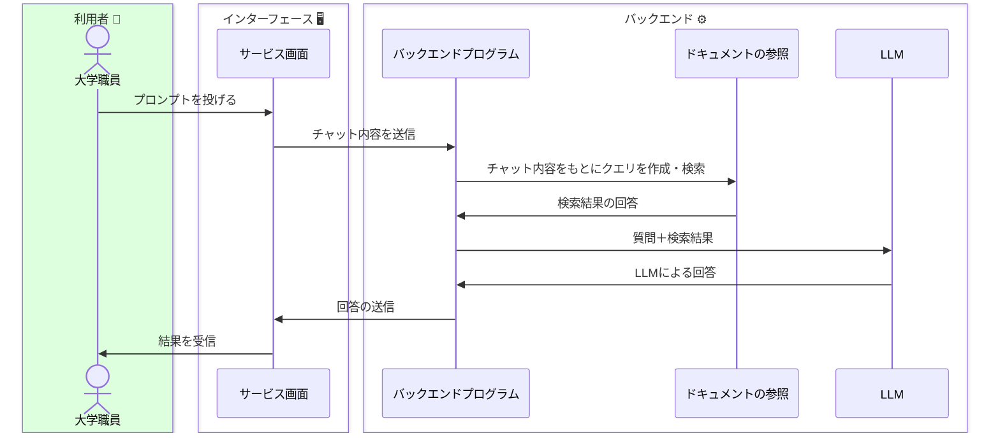
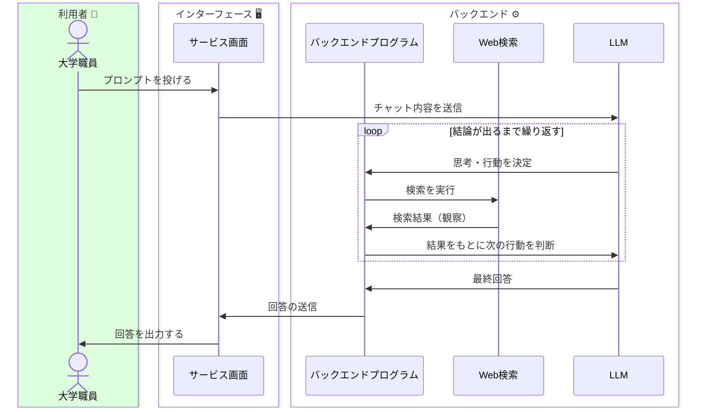
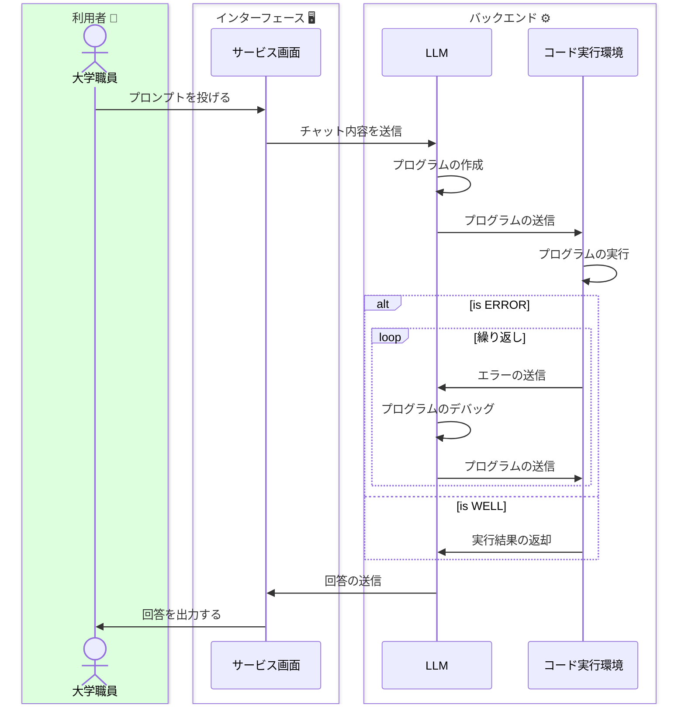
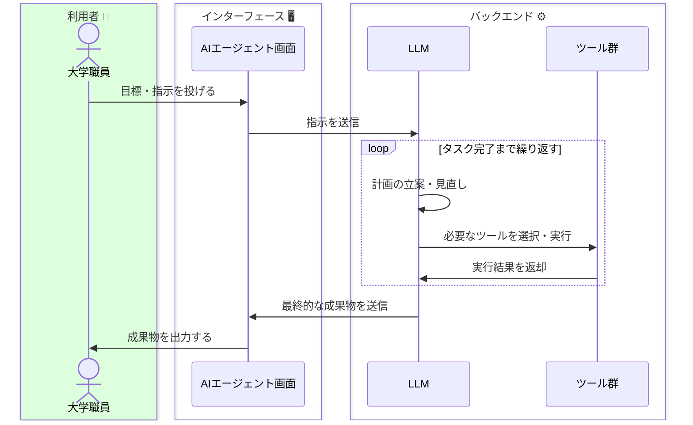





ChatGPTで使用されているAIモデルが[WebAPIで公開](https://openai.com/blog/introducing-chatgpt-and-whisper-apis)されており、従量課金制で誰でも利用できます。ChatGPTだけではなくClaudeやGeminiもWebAPIを公開しています。WebAPIを叩けると、技術者が泣いて喜びます。なぜなら生成AIの内部モデルを別のサービスやシステムに組み込むことができるからです。<strong>その最たる例がMicrosoftのCopilotです。</strong>従来の検索エンジンにLLMを使用することで、Webサイトの情報を利用者へ素早く・分かりやすく提供しています。

そのほか、こうした「AIモデルを組み込んだサービス」は[星の数](https://aismiley.co.jp/ai_news/generativeai-chaosmap/)ほどあります。そのすべてを紹介することはできませんので、メジャーな生成AIサービスの類型を紹介します。

## 🗂️ 生成AIサービスの類型
---
 

### - 基本型
#### LLM[外部ツール無し]
例：ChatGPT、Claude

Web検索に対応していない生成AIサービスです。このほか、例えば会議の議事録を要約するサービスが該当します。

 

### - 検索エンジン型
#### LLM+Web検索
例：Copilot、Gemini、Perplexity

検索エンジンが搭載された生成AIサービスです。無料で高性能なAIモデルを活用できるケースも多いため、ChatGPTではなくこちらを積極的に活用している方もいます。

 

### - ナレッジ参照型
#### LLM+ドキュメント
例：窓口応答システム、社内文書システム等

無料かつWeb公開されているサービスではほぼ見られませんが、LLMの訓練データを超えたデータを埋め込むタイプの生成AIサービスがあります。特に一般向け・社内向けに整備されたものが多い印象です。

 

### - 自律エージェント型(1)
#### LLM+自律的な推論と行動
例：AutoGPT（初期の代表例）、現在の各種AIエージェント

AIエージェントとは、**AIが自ら考え、ツールを使い、タスクを遂行する仕組み**です。利用者が目標を与えると、AIが自律的に計画を立て、必要な情報を集め、結論を導きます。利用者としてエージェントに仕事を任せる考え方は[AIエージェントとタスク設計]({})で紹介しています。

2023年に登場したAutoGPTは、LLMに「思考→行動→観察」のループ（ReActパターン）を繰り返させる初期の代表例でした。現在では、ChatGPT・Claude・Geminiなどの主要サービスに同様の仕組みが標準的に組み込まれています。

 

### - 自律エージェント型(2)
#### LLM+コード実行環境

ChatGPTやClaudeなどの主要な生成AIサービスには、**自然言語のプロンプトからプログラムを作成・実行する機能**が搭載されています。利用者がコードを書けなくても、データ分析やグラフ作成などをAIに任せることができます。

例えばChatGPTでは「データ分析」機能（旧称：Code Interpreter）として、Claudeでは「Artifacts」として、こうしたコード実行機能が提供されています。

 

### - AIエージェントの発展
#### LLM+複数のツール・データソース

現在のAIエージェントは、Web検索やコード実行だけでなく、**様々な外部ツールやデータソースと連携**できるようになっています。

例えばChatGPTの「GPTs」では、利用者が目的に合わせたカスタムAIを作成でき、Claudeの「Projects」では、ドキュメントを参照しながら対話できます。こうしたユーザー向け機能の充実により、専門知識がなくてもAIエージェントの恩恵を受けやすくなりました。

また技術的な基盤として、**MCP（Model Context Protocol）** という共通規格が登場しています。MCPは、様々なツールやデータソースをAIに接続するための共通規格です。これにより、AIサービス間で統一的にツール連携が行えるようになりつつあります。

2025年以降、Manus、Claude Code、Devinなどのエージェント型ツールが登場し、AIがより複雑なタスクを自律的にこなせるようになりつつあります。こうしたツールは今後も増えていくと考えられますが、基本的な仕組み（LLMがツールを選択・実行するループ）は上記の構造と同じです。なお、エージェントの推論能力を支える「推論モデル」については[推論モデルを知る]({})で解説しています。

{}
AIエージェントが発展しても、<strong>最終的な判断と責任は利用者にある</strong>という原則は変わりません。AIが自律的に動くからこそ、結果の確認と適切な指示がより重要になります。
{}

## 📚 参考文献
https://speakerdeck.com/hirosatogamo/chatgpt-azure-openai-da-quan?slide=29