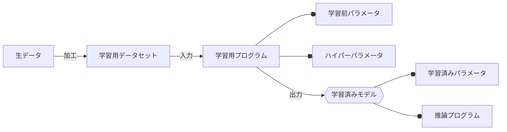





## なぜモデルの仕組みを知るのか
---

生成AIの中身を知らなくてもプロンプトは書けます。しかし仕組みをざっくり知っておくと、**AIの振る舞いの「なぜ」がわかるようになります。**

- なぜAIは最新のニュースを知らないことがあるのか（→ 知識カットオフ）
- なぜ同じ質問に毎回違う答えを返すのか（→ 確率的な生成）
- なぜもっともらしい嘘をつくのか（→ パターン学習の性質）

こうした「なぜ」を理解しておくと、[生成AIの扱い方]({})で述べた「提案として扱う」姿勢が、納得感を持って身につきます。

 

生成AIサービスでは事前に収集したデータを学習(訓練)する過程を経て作成した学習済みモデルが使用しています。
例えばChatGPTにはGPTシリーズが、GeminiにはGeminiシリーズのモデルが使用されています。
それはどのように作成(学習)され、生成AIサービスとして使われているのでしょうか。  

## 🧠 学習段階
--- 

一般的な言語モデルの学習段階は、主に以下のステップで構成されます。

### - 生データ -> 学習用データセット
- **生データ収集**: インターネット上の文章、書籍、ニュース記事、ウィキペディアのテキストなど、多種多様なソースから大量のテキストデータを収集します。
- **前処理**: 収集したデータは、ノイズが含まれていたり、不適切な内容が含まれている可能性があります。これらをクリーニングし、モデルが学習しやすい形式に整形します。具体的には、トークン化（テキストを意味のある単位に分割）、正規化（テキストの標準化）、不適切な内容の除去などが含まれます。

 

### - 学習用プログラム
- **モデルアーキテクチャの選定**: Transformerアーキテクチャなど、ニューラルネットワークの構造を決定します。
- **学習アルゴリズムの実装**: ディープラーニングの学習アルゴリズム（例：バックプロパゲーション）を実装し、モデルがデータからパターンを学習できるようにします。

 

### - (学習プロセス)
- **データセットの準備**: 前処理されたデータをトレーニングセット、バリデーションセット、テストセットに分割します。
- **トレーニング**: トレーニングセットを使用してモデルを学習させます。これには、膨大な計算資源と時間が必要です。モデルは、テキストのパターン、文法、意味論的関係などを理解するようになります。
- **バリデーションとチューニング**: バリデーションセットを使用してモデルの性能を評価し、ハイパーパラメータを調整します。
- **評価**: テストセットを使用して、モデルが未知のデータに対してどのように機能するかを評価します。
- **最適化**: 必要に応じて、さらなるチューニングやモデルのサイズ調整を行い、性能と効率のバランスを取ります。

 

### - 学習済みモデル
- **保存**: 学習が完了したモデルは、ファイルとして保存され、後の使用や共有のためにアーカイブされます。
- **展開**: 学習済みモデルは、アプリケーションやサービスに組み込まれ、実際のタスクに使用されます。

これらのステップは、大規模な言語モデルを構築するために必要な、高度に専門化されたプロセスです。それぞれのステップは、データサイエンティスト、機械学習エンジニア、ソフトウェアエンジニアなど、多くの専門家の協力を必要とします。

 

## 💻 利用段階
---

 

大規模言語モデルの利用段階は、以下のステップで構成されます。

### - 入力データ
- **ユーザーからの入力**: ユーザーは質問、コマンド、文章などの形で入力を提供します。これはテキスト形式であることが一般的です。
- **入力の前処理**: モデルが処理できる形に入力データを変換します。これには、トークン化（テキストを小さな単位に分割）、正規化、必要に応じて言語の検出や翻訳などが含まれます。

 

### - 学習済みモデル
- **モデルへの入力**: 前処理された入力データは、学習済みの言語モデルに供給されます。
- **処理と推論**: 言語モデルは入力データを処理し、文脈に基づいた適切な応答を生成します。これには、テキストの意味理解、関連情報の抽出、新しい文章の生成などが含まれます。

 

### - 生成物
- **応答の生成**: モデルは、質問に対する回答、テキストの続き、情報の要約など、要求に応じた内容を生成します。
- **後処理**: 必要に応じて、生成されたテキストに後処理を施します。これには、文法の調整、スタイルの整合性の確保、不適切な内容のフィルタリングなどが含まれる場合があります。
- **ユーザーへの提供**: 最終的な生成物は、ユーザーに提示されます。これは、ウェブインターフェース、API応答、書面によるレポートなど、多様な形式で行われます。

 

### - (フィードバックと改善)
- **ユーザーフィードバックの収集**: ユーザーからのフィードバックを収集し、モデルの性能評価に利用します。
- **継続的な改善**: フィードバックに基づいて、モデルの微調整やアップデートを行うことで、精度やユーザー体験を向上させます。

大規模言語モデルの利用段階では、モデルが以前に学習した知識を活用して新しい問い合わせに応答し、有用な情報や内容を生成します。ユーザーのニーズやコンテキストに応じて柔軟に対応できるよう、継続的な改善とアップデートが重要となります。

 

## 💡 学習済みモデルの理解がプロンプトに活きる場面
---

ここまでの内容を踏まえると、普段のAI活用に役立つ気づきがいくつかあります。

### - 知識カットオフ → 文脈を渡す理由
モデルは学習時点までのデータしか持っていません。最新の情報が必要な場合は、**自分でファイルやURLを渡して文脈を補う**ことが重要です。「AIが知らないかもしれない」という前提で使うことで、ハルシネーションのリスクを減らせます。

### - 訓練データの偏り → 多角的な視点を求める理由
学習データにはインターネット上のテキストが多く含まれるため、特定の視点や文化圏に偏りがあります。大学業務で使う場合は、**複数の立場からの意見を求める**プロンプトが有効です（詳しくは[AIの出力とバイアス]({})を参照）。

### - RLHF（人間のフィードバックによる調整） → モデルが「助けたがる」理由
多くのモデルは、人間のフィードバックを通じて「役に立つ回答」を優先するよう調整されています。その結果、**わからないことでも何かしら答えようとする**傾向があります。「わからなければ『わかりません』と言ってください」と明示することも時に有効です。

### - トークンベースの処理 → 構造化が効く理由
モデルはテキストを「トークン」という単位に分割して処理しています。見出し・箇条書き・区切り線などで**構造化された入力は、モデルにとっても処理しやすく**、より正確な出力につながりやすいです（[マークダウンを使おう]({})も参照）。

 

## 📚 参考文献
---
https://www.meti.go.jp/policy/mono_info_service/connected_industries/sharing_and_utilization/20180615001-3.pdf