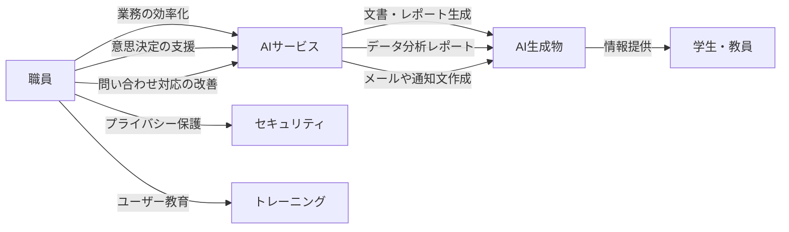
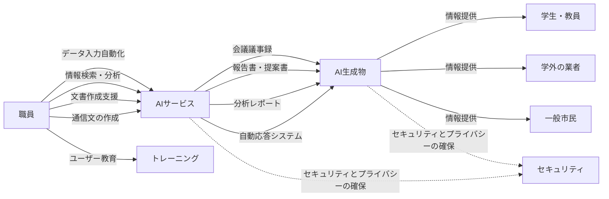
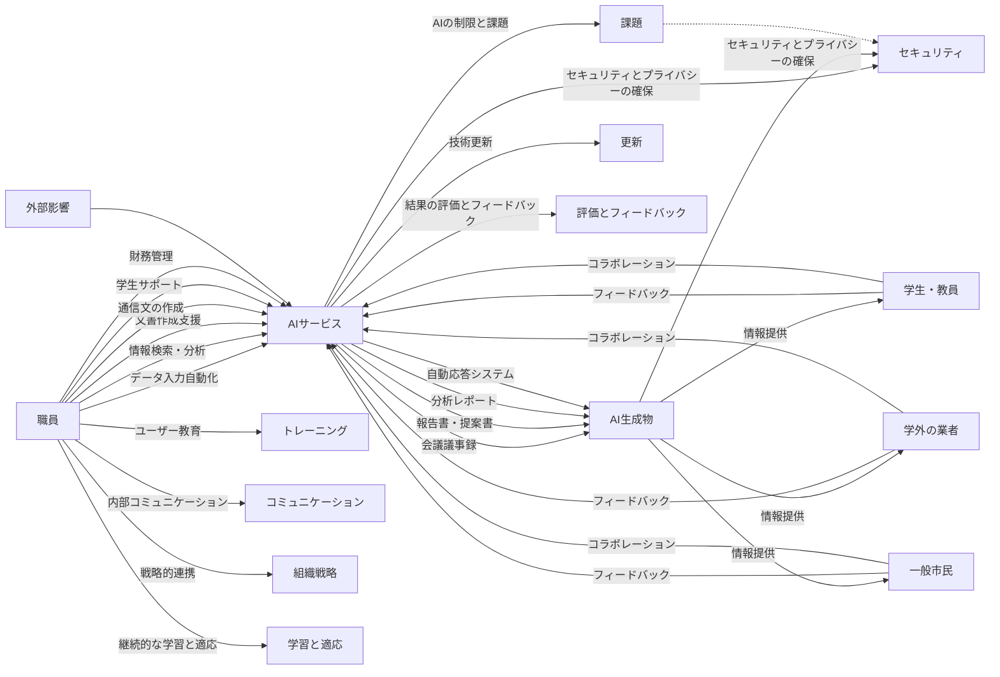
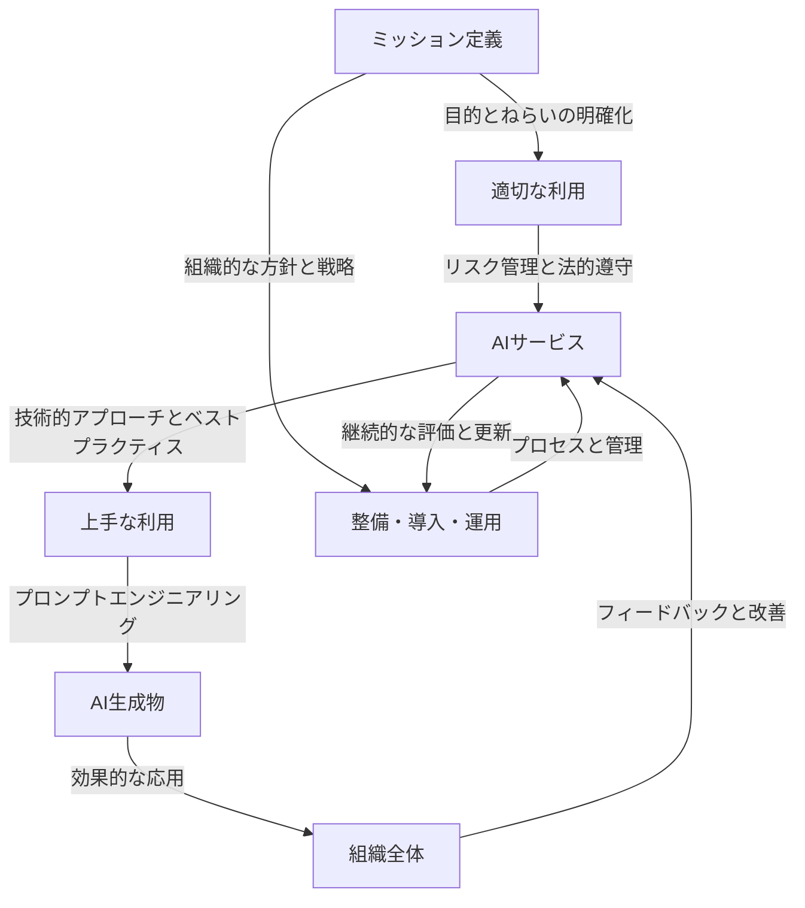
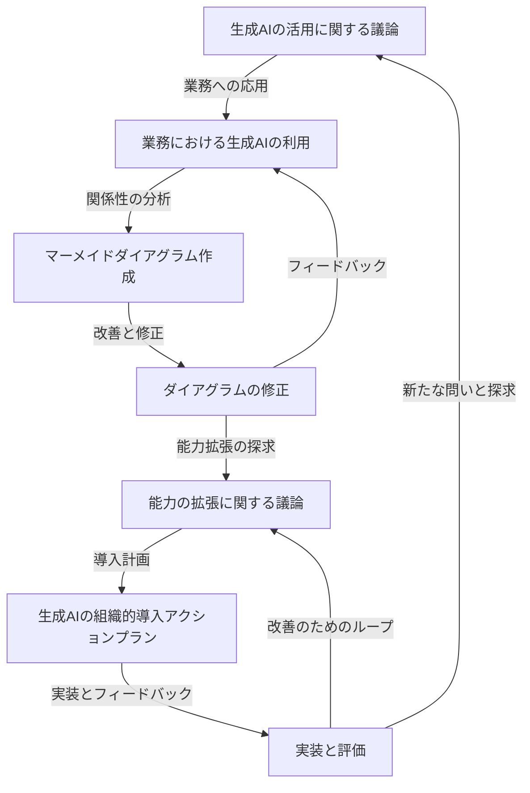

## 🗺️ ポイント

早稲田大学アカデミックソリューション・大学業務ソリューションセミナーにむけて、大学業務と生成AIの関係を整理するための試行の壁打ちを実施した。



| 日時 | 生成AIサービス | 共有URL |
|----------|--------------|---------|
| 2023/11/25 | ChatGPT (GPT-4) | https://chat.openai.com/share/67fdd93c-8286-4e6b-9636-287425bfe725|

<br>

## 🧐 プロンプトの解説

### - 背景
ChatGPT/生成AIの講演を何度か実施したあと、大学業務における生成AI利用の勘どころを整理してみたいと思った。  
最初のプロンプトはとりあえずこれだけ。

```
Chatgpt等の生成AIサービスを上手に利用するために、適した業務、やるべき業務について一緒に考えましょう。
AIモデルやAIアーキテクチャの研究・開発ではなく、サービスとして提供されているものの利用です。
文脈：大学の事務職員が担う事務業務

準備ができたらOKと答えてください
```

{}
了解しました。大学の事務職員が担う事務業務における、ChatGPTや他の生成AIサービスの適切な利用方法について考えましょう。
準備ができましたので、具体的な業務や問題点について教えてください。
それに基づいて、どのようにAIを効果的に活用できるかを一緒に考えます。    
{}

{}
いきなり本題には入らず、mockさせて、会話の下準備をしておく。
{}
<br>

### - mermaid


マーメイド記法で関係性を可視化する。

```
まず何から考えればいいのだろう。生成AIサービスを利用するには、職員自身が利用することと、問い合わせ者(学生や教員)が利用することが考えられるように思う。

アクター(職員、学生、教員)、サービス、AI生成物の3者間の関係から、業務形態を考えてみたいな。

まず、職員自身が利用する場合：
これはどのような関係を想定できる？
```
{}
大学の事務職員が生成AIサービスを利用する場合を考えると、以下のような関係性や利用形態が考えられます：

1. 職員とAIサービスの関係性
業務の効率化: AIを使って、時間のかかるデータ入力や情報検索、文書作成などの作業を自動化し、業務の効率を向上させる。
意思決定の支援: 統計データの分析やトレンドの予測など、AIを活用してより情報に基づいた意思決定を行う。
問い合わせ対応の改善: AIを用いて、よくある質問への自動応答システムを構築し、学生や教員からの問い合わせに迅速かつ正確に対応する。
2. 職員が生成するAIコンテンツの種類
文書・レポート: AIを利用して、会議の議事録、イベントの報告書、プロジェクトの提案書などを作成。
データ分析レポート: データセットを分析し、その結果をレポート形式で生成する。
メールや通知文: 日常のコミュニケーションや通知を効率的に作成。
3. AIサービスの活用における注意点
信頼性の確保: 提供される情報の正確性と信頼性を確認する。
プライバシー保護: 学生や教員の個人情報を扱う際のセキュリティ対策を徹底する。
ユーザー教育: 職員自身がAIサービスの機能や限界を理解し、適切に利用するための研修を実施。
以上のように、AIサービスを事務業務に取り入れることで、業務の効率化や質の向上を図ることができます。次に、学生や教員がAIサービスを利用する場合についても検討してみましょう。    
{}

```
関係性をmermaidフォーマットで書いてください
```
{}

大学の事務職員が生成AIサービスを利用する際の関係性を、Mermaidフォーマットで図示すると以下のようになります：

```
mermaid
Copy code
graph LR
    A[職員] -->|業務の効率化| B[AIサービス]
    A -->|意思決定の支援| B
    A -->|問い合わせ対応の改善| B
    B -->|文書・レポート生成| C[AI生成物]
    B -->|データ分析レポート| C
    B -->|メールや通知文作成| C
    C -->|情報提供| D[学生・教員]
    A -->|プライバシー保護| E[セキュリティ]
    A -->|ユーザー教育| F[トレーニング]
```
この図は、職員がAIサービスを利用して、どのように業務を効率化し、さまざまな出力（AI生成物）を生成し、それを学生や教員に提供するかを示しています。また、セキュリティやトレーニングの重要性も強調しています。この図は、職員とAIサービス、生成物、そして最終的な利用者（学生や教員）の間の相互作用を視覚的に表現しています。
{}

mermaid記法はNotionやGithub等に対応している。レンダリング後のグラフを確認したければ[mermaid.live](https://mermaid.live/)が一番お手軽。

#### レンダリング後：


これをベースに議論を進める。

<br>

### - 繰り返し処理
成果物の改善のために繰り返し処理を設ける。  
[深津さんの弁証法エンジン](https://note.com/fladdict/n/nf5de15f7104d)を日本語に書き換えた感じ。

```
いいですね、ではこのダイアグラムを、建設的かつ批判的観点から改善しましょう。

1.  改善すればもっと良くなる点、意味がはっきりしていない点、課題などを5つあげる
2. 1.で挙げた点に基づき、修正点を5つ挙げる
3. ダイアグラムダイアグラムを積極的・抜本的に修正し、出力する
4. 1.から3.を3回繰り返す
```
{}

このプロセスに従って、ダイアグラムを改善していきましょう。

1. 改善すべき点
関係の明確化: AIサービスがどのように具体的な業務に結びつくのか、より詳細な関係性が必要。
セキュリティとプライバシーの影響範囲: セキュリティとプライバシーの確保がどのように業務全体に影響を及ぼすかを明確にする。
AIの制限と課題の表現: AIの限界や潜在的な課題をダイアグラムに組み込む。
双方向の関係性: 現在のダイアグラムは一方通行の関係が多いが、相互作用を示す要素が必要。
利用者のフィードバック: 学生、教員、外部業者からのフィードバックがAIサービスの改善にどう影響するかを示す。
2. 修正点
具体的な業務とAIサービスの関係を詳細化: 各業務とAIサービス間の具体的な関係を追加する。
セキュリティとプライバシーの影響を全体に拡大: セキュリティの要素を各関係に統合する。
AIの制限と課題を明記: AIの制限と課題を新たなノードとして追加する。
相互作用の追加: 双方向の関係を示す矢印を追加する。
フィードバックループの追加: 利用者からのフィードバックがAIサービスの改善にどう結びつくかを示す。
3. 修正後のダイアグラム
```
graph LR
    A[職員] -->|データ入力自動化| B[AIサービス]
    A -->|情報検索・分析| B
    A -->|文書作成支援| B
    A -->|通信文の作成| B
    B -->|会議議事録| C[AI生成物]
    B -->|報告書・提案書| C
    B -->|分析レポート| C
    B -->|自動応答システム| C
    C -->|情報提供| D[学生・教員]
    C -->|情報提供| E[学外の業者]
    C -->|情報提供| F[一般市民]
    B -->|セキュリティとプライバシーの確保| G[セキュリティ]
    C -->|セキュリティとプライバシーの確保| G
    A -->|ユーザー教育| H[トレーニング]
    D -->|フィードバック| B
    E -->|フィードバック| B
    F -->|フィードバック| B
    B -->|AIの制限と課題| I[課題]
    I -.-> G
```
1. 第二ステップへの移行
上記の修正に基づいて、さらなる改善点を検討し、再度ダイアグラムを修正します。
{}


```
next
```
{}
1. 第二ステップの改善点
業務カテゴリの明確化: 現在のダイアグラムでは、具体的な業務カテゴリが明確でない。より具体的な業務領域（例：学生サポート、財務管理など）を明示する。
外部の影響: 学外の要因（政策変更、市場の動向など）がAIサービスの利用にどのように影響するかを示す。
技術更新の対応: AI技術の進化に伴う更新や改善のプロセスを示す。
内部コミュニケーションの強化: 職員間のコミュニケーションと協力の重要性を強調する。
組織全体の戦略との連携: AI利用が組織全体の戦略や目標とどのように連携するかを示す。
2. 第二ステップの修正点
業務カテゴリの追加: 各業務領域を具体的にダイアグラムに追加する。
外部影響の要素追加: 学外の影響を考慮した新たなノードを追加する。
技術更新のプロセスの追加: AIサービスの更新や改善のプロセスを示す。
内部コミュニケーションの要素追加: 職員間のコミュニケーションと協力を示す。
戦略的連携の強調: AIの利用が組織の戦略や目標にどのように結びつくかを示す。
3. 第二ステップの修正後のダイアグラム
```
graph LR
    A[職員] -->|データ入力自動化| B[AIサービス]
    A -->|情報検索・分析| B
    A -->|文書作成支援| B
    A -->|通信文の作成| B
    A -->|学生サポート| B
    A -->|財務管理| B
    B -->|会議議事録| C[AI生成物]
    B -->|報告書・提案書| C
    B -->|分析レポート| C
    B -->|自動応答システム| C
    C -->|情報提供| D[学生・教員]
    C -->|情報提供| E[学外の業者]
    C -->|情報提供| F[一般市民]
    B -->|セキュリティとプライバシーの確保| G[セキュリティ]
    C -->|セキュリティとプライバシーの確保| G
    A -->|ユーザー教育| H[トレーニング]
    D -->|フィードバック| B
    E -->|フィードバック| B
    F -->|フィードバック| B
    B -->|AIの制限と課題| I[課題]
    I -.-> G
    J[外部影響] --> B
    B -->|技術更新| K[更新]
    A -->|内部コミュニケーション| L[コミュニケーション]
    A -->|戦略的連携| M[組織戦略]
```
1. 第三ステップへの移行
第二ステップの改善を踏まえて、さらにダイアグラムを洗練させるための改善点を検討します。
{}

...こんな感じで3回ループさせる。一つの会話で3回ぐるぐる回すと処理が省略されて品質が落ちるので、会話をまたいで行う。  
修正前後のダイアグラムをレンダリングして比較しよう。


#### 修正前：


#### 修正後：


冗長な感が否めないが、修正前のダイアグラムを拡大解釈してくれる点は助かる。


### - 抽象化

↑で挙げた修正後ダイアグラムを整理するために抽象化を実施。

```
素晴らしいダイアグラムをご提供いただきありがとうございます。
このダイアグラムを抽象化して、以下の4要素に集約してくれませんか。

* ミッション定義
業務に生成AIを利用する目的やねらい
* 適切な利用
リスクを最小限に抑え、試行錯誤を繰り返し、AIを適切に扱う
* 上手な利用
プロンプトエンジニアリングなど、AIを有効に活用する
* 整備・導入・運用
組織的に導入し、整備し、運用する。大学構成員がAIと向き合う

1. 4要素を踏まえてダイヤグラムの不足点があれば補ってください
2. 4要素に基づいた抽象化・体系化を実行
```
{}

ご指定の4要素に基づいて、ダイアグラムの不足点を補い、抽象化・体系化を行います。

1. ダイアグラムの不足点の補充
ミッション定義: AI利用の目的やねらいを明確に定義する要素の追加。
適切な利用: リスク管理、プライバシー保護、法的遵守などの要素を強調。
上手な利用: AIを効果的に活用するためのベストプラクティスや技術的アプローチの要素を追加。
整備・導入・運用: 組織的な導入、整備、運用に関連するプロセスや管理の要素を強調。
2. 4要素に基づいた抽象化・体系化されたダイアグラム
```
graph LR
    A[ミッション定義] -->|目的とねらいの明確化| B[適切な利用]
    B -->|リスク管理と法的遵守| C[AIサービス]
    C -->|技術的アプローチとベストプラクティス| D[上手な利用]
    D -->|プロンプトエンジニアリング| E[AI生成物]
    E -->|効果的な応用| F[組織全体]
    A -->|組織的な方針と戦略| G[整備・導入・運用]
    G -->|プロセスと管理| C
    F -->|フィードバックと改善| C
    C -->|継続的な評価と更新| G
```
この抽象化されたダイアグラムは、AI利用の全体的なプロセスを4つの主要な要素に集約しています。ミッションの定義から適切な利用、上手な利用の実施、そして組織全体での整備・導入・運用に至るまでの一連のステップを示しています。これにより、AIサービスの利用を効果的かつ持続可能にするための基本的な枠組みを提供しています。
{}


#### レンダリング後(左⇒右から上⇒下に変更)：


イイ感じである。ちなみにダイアグラムの向きの変更も会話の中で訊いた賜物である。

```
縦方向と横方向、何を変えたらそうなった？
```
{}
縦方向と横方向のダイアグラムを作成する際の主な違いは、要素間の接続の方向です。Mermaidダイアグラムでの方向性は、最初の行で指定されたコマンドによって決定されます。

横方向のダイアグラム: graph LR（Left to Right）のコマンドを使用して、要素が左から右へと接続されます。
縦方向のダイアグラム: graph TD（Top to Down）のコマンドを使用して、要素が上から下へと接続されます。
この方向性の指定以外の部分（要素や接続の内容）は変更せず、単に接続の方向だけを変えることで、ダイアグラムの方向性を縦または横に調整することができます。
{}

<br>

## ✅ 得られた成果

```
graph TD
    A[生成AIの活用に関する議論] -->|業務への応用| B[業務における生成AIの利用]
    B -->|関係性の分析| C[マーメイドダイアグラム作成]
    C -->|改善と修正| D[ダイアグラムの修正]
    D -->|フィードバック| B
    D -->|能力拡張の探求| E[能力の拡張に関する議論]
    E -->|導入計画| F[生成AIの組織的導入アクションプラン]
    F -->|実装とフィードバック| G[実装と評価]
    G -->|改善のためのループ| E
    G -->|新たな問いと探求| A
```




## 🚪 さいごに

- 最終的に出てきたダイアグラムを加筆・修正して大学業務ソリューションセミナーの発表資料にお出しできたので満足
- 試行の壁打ち極まれりな事例なので、ぜひ真似してください