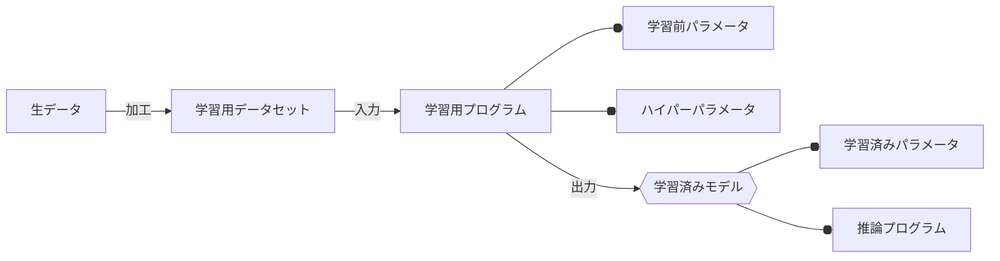
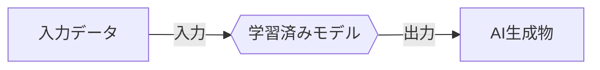

詳しくは「想定するAI技術の実用化の過程」を参照いただきたい。

### 学習段階

```mermaid
graph LR
    A[生データ] -->|加工| B[学習用データセット]
    B -->|入力| C[学習用プログラム]
    C --o D[学習前パラメータ]
    C --o E[ハイパーパラメータ]
    C -->|出力| F{{学習済みモデル}}
    F --o G[学習済みパラメータ]
    F --o H[推論プログラム]
```

### 利用段階

```mermaid
graph LR
    A[入力データ] -->|入力| B{{学習済みモデル}}
    B -->|出力| C[AI生成物]
```
参考：
https://www.meti.go.jp/policy/mono_info_service/connected_industries/sharing_and_utilization/20180615001-3.pdf