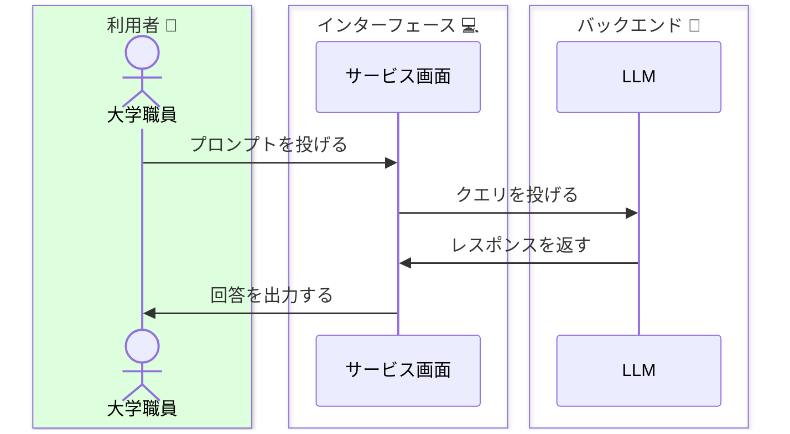
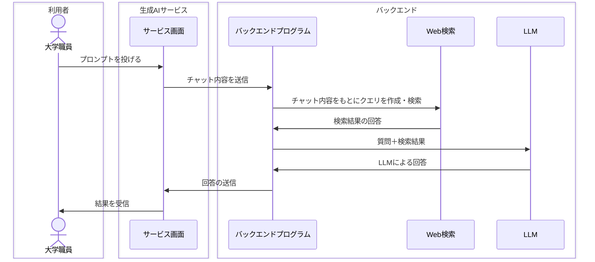
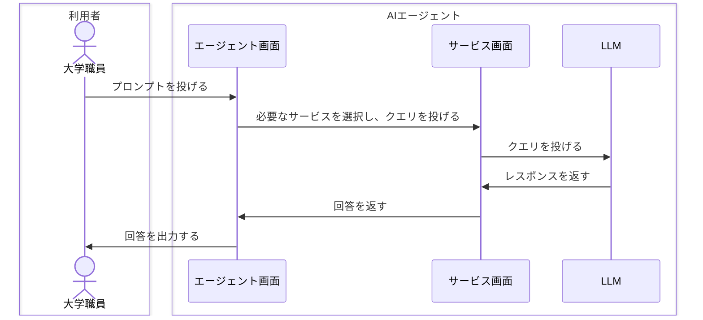

このページで作図は多くの技術的要素を省略しています

- 生成AIサービスに含まれるツール
- 検索エンジンと生成AI
- プログラム実行環境と生成AI
- 画像生成AIとテキスト生成AI
- RAGと生成AI

通常の対話型生成AIサービス

検索型・対話型生成AIサービス

今後の生成AIサービス

参考URL
https://speakerdeck.com/hirosatogamo/chatgpt-azure-openai-da-quan?slide=29